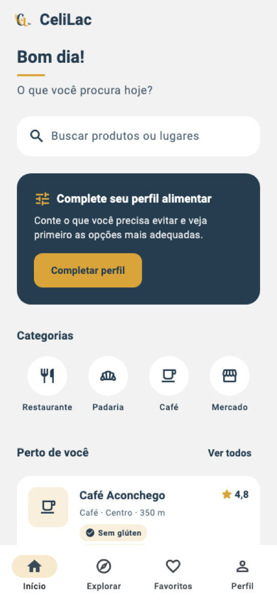
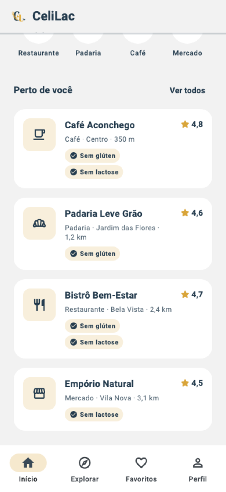

# CeliLac: Homepage Profissional
## Tema, navegação, dados, estados, acessibilidade e testes, passo a passo

---

# Como usar este material

Este material continua o **CeliLac: Splash e Onboarding Profissionais**. Lá, o usuário chegava à `HomePage`, que era só um texto no centro da tela. Aqui, transformamos essa tela no **centro do aplicativo**:

```text
Splash ──► Onboarding ──► AppShell (barra de navegação inferior)
                              ├── Início    ← HomePage (este material)
                              ├── Explorar  ← "em breve"
                              ├── Favoritos ← "em breve"
                              └── Perfil    ← "em breve"
```

As legendas são as mesmas do material anterior:

- 📘 **Conceito**: a ideia por trás do código, que vale para qualquer projeto.
- 💻 **Código**: o que foi implementado no CeliLac.
- ⚠️ **Atenção**: armadilhas comuns.
- 🧩 **No seu projeto**: o que adaptar para o seu app.
- ▶️ **Execute**: o momento de rodar o app e verificar o resultado.
- 🧪 **Teste**: verificação automatizada (novidade deste material).

> O objetivo continua o mesmo: **entender cada decisão** para aplicá-la no seu projeto, com a sua marca, o seu domínio e os seus dados. O CeliLac mostra estabelecimentos. O seu app pode mostrar livros, treinos, eventos ou pedidos: a estrutura é a mesma.

> ✅ Todo o código deste material foi compilado com `flutter analyze` (sem avisos) e validado com 10 testes automatizados (Parte 7), no Flutter 3.47 / Dart 3.13.

## Resultado esperado

| Topo da Home | Lista "Perto de você" |
|---|---|
|  |  |

---

# Parte 0: Antes do código

## 0.1 📘 Conceito: o papel da Home

A Home é a tela que o usuário vê **todos os dias**. A Splash e o onboarding aparecem uma vez; a Home aparece em toda abertura do app. Por isso, ela precisa responder rapidamente a três perguntas:

1. **Onde estou?** Identidade (logo, nome, cores) e contexto (saudação).
2. **O que posso fazer aqui?** As ações principais, visíveis sem procurar.
3. **Qual o próximo passo?** Uma sugestão clara do que fazer agora.

Uma Home que tenta mostrar **tudo** não responde a nenhuma delas. O trabalho de design é **escolher** o que entra e, principalmente, o que fica de fora.

## 0.2 A Home cumpre as promessas do onboarding

O onboarding fez três promessas ao usuário. Uma Home profissional **entrega** essas promessas logo na primeira tela, senão o onboarding vira propaganda enganosa.

| Página do onboarding | Promessa | Onde a Home entrega |
|---|---|---|
| 1. Descoberta | "Encontre opções adequadas a você" | Busca, categorias e lista "Perto de você" |
| 2. Informação | "Entenda antes de escolher" | Cartões com selos "Sem glúten" / "Sem lactose", distância e nota |
| 3. Personalização | "Uma experiência mais relevante" | Cartão "Complete seu perfil alimentar" |

🧩 **No seu projeto:** antes de desenhar a Home, releia as frases do seu onboarding e faça esta mesma tabela. Cada promessa precisa de um lugar na Home.

## 0.3 Estrutura e hierarquia

```text
┌─────────────────────────────────┐
│ [logo] CeliLac                  │ ← SliverAppBar (fixa no topo)
├─────────────────────────────────┤
│ Bom dia!                        │ ← 1. Contexto: saudação
│ ▬▬                              │    (assinatura dourada)
│ O que você procura hoje?        │
│                                 │
│ ┌─────────────────────────────┐ │
│ │ 🔍 Buscar produtos ou lugares│ │ ← 2. Ação principal: busca
│ └─────────────────────────────┘ │
│ ┌─────────────────────────────┐ │
│ │ Complete seu perfil         │ │ ← 3. Próximo passo (destaque)
│ │ [Completar perfil]          │ │
│ └─────────────────────────────┘ │
│                                 │
│ Categorias                      │ ← 4. Atalhos
│  (🍴)  (🥐)  (☕)  (🏪)          │
│                                 │
│ Perto de você        Ver todos  │ ← 5. Conteúdo (dados assíncronos)
│ ┌─────────────────────────────┐ │
│ │ ☕ Café Aconchego      ★ 4,8 │ │
│ │ Café · Centro · 350 m       │ │
│ │ [✓ Sem glúten] [✓ Sem lact.]│ │
│ └─────────────────────────────┘ │
│ ...                             │
├─────────────────────────────────┤
│  Início  Explorar  Favoritos  Perfil │ ← NavigationBar (fixa)
└─────────────────────────────────┘
```

📘 **Por que essa ordem?** O olho percorre a tela de cima para baixo. O que está no topo é visto por **todos**; o que está no fim, só por quem rola. Por isso:

- **Busca no topo**: é a ação mais frequente de quem procura algo ("Descoberta").
- **Cartão de perfil logo depois**: é o passo que **melhora todo o resto** do app. Como é uma ação única (feita uma vez), ele aparece com destaque, mas não acima da busca.
- **Categorias antes da lista**: atalhos curtos e previsíveis. O usuário que não sabe o nome do lugar começa por elas.
- **Lista por último**: é o conteúdo que **pode crescer**. Colocá-la no fim permite rolar sem empurrar as ações para fora da tela.

## 0.4 O que fica de fora (e por quê)

Tão importante quanto o que entra é o que **não** entra:

| Tentação | Por que não agora |
|---|---|
| Ícone de notificações no topo | O app não tem notificações. **Botão que não faz nada destrói a confiança.** |
| Carrossel automático de banners | Movimento constante disputa atenção com o conteúdo, e banners de "propaganda" costumam ser ignorados (*banner blindness*). |
| Muitas seções ("Receitas", "Novidades", "Mais vistos"...) | Sem dados reais, seriam seções vazias ou falsas. Comece pequeno e cresça com o produto. |
| Animação de entrada elaborada | A Home é vista **várias vezes por dia**. Veja a Parte 6.5. |

> ⚠️ **E a busca, as categorias e o perfil, que ainda não existem?** Eles são o **núcleo** do produto e vão existir em breve. Por isso aparecem, mas **dão feedback** ao toque ("estará disponível em breve"). Um elemento que não responde ao toque parece quebrado; um que explica, não.

## 0.5 Estrutura de pastas

```text
lib/
├── main.dart
├── app/
│   ├── celilac_app.dart                     ← (alterado) usa o tema
│   ├── common/
│   │   ├── formatters.dart                  ← novo: distância e decimais
│   │   └── widgets/
│   │       ├── coming_soon_view.dart        ← novo: abas "em breve"
│   │       ├── gold_accent.dart
│   │       └── image_card.dart
│   ├── routes/
│   │   └── fade_route.dart                  ← novo: transição com fade
│   ├── shell/
│   │   └── app_shell.dart                   ← novo: barra de navegação
│   └── theme/
│       ├── app_colors.dart
│       ├── app_radius.dart                  ← novo
│       ├── app_spacing.dart                 ← novo
│       └── app_theme.dart                   ← novo
└── features/
    ├── establishments/                      ← nova feature
    │   ├── data/
    │   │   └── fake_establishment_repository.dart
    │   ├── domain/
    │   │   ├── dietary_option.dart
    │   │   ├── establishment.dart
    │   │   ├── establishment_category.dart
    │   │   └── establishment_repository.dart
    │   └── presentation/
    │       ├── establishment_category_icon.dart
    │       └── widgets/
    │           ├── dietary_badge.dart
    │           └── establishment_card.dart
    ├── home/
    │   └── presentation/
    │       ├── greeting.dart
    │       ├── pages/
    │       │   └── home_page.dart           ← (reescrito)
    │       └── widgets/
    │           ├── category_shortcuts.dart
    │           ├── home_header.dart
    │           ├── nearby_states.dart
    │           ├── profile_prompt_card.dart
    │           ├── search_entry.dart
    │           └── section_header.dart
    ├── onboarding/                          ← (alterado) navega para o AppShell
    └── startup/                             ← (alterado) navega para o AppShell

test/
├── app/
│   └── formatters_test.dart
└── features/
    └── home/
        ├── greeting_test.dart
        └── home_page_test.dart
```

📘 **Por que uma feature `establishments` separada da `home`?** A Home é uma **tela** que reúne coisas de vários assuntos. "Estabelecimento" é um **assunto** do app: ele vai aparecer também em "Explorar", "Favoritos" e na busca. Se o modelo e o cartão ficassem dentro de `home/`, as outras telas teriam que importar "coisas da Home", o que não faz sentido. Regra prática:

- o que é **da tela** fica na feature da tela (`home/`: saudação, cabeçalho, cartão de perfil);
- o que é **do domínio** ganha a sua própria feature (`establishments/`: modelo, repositório, cartão de estabelecimento).

## 0.6 Roteiro

```text
Parte 1  Fundação visual     tokens de espaçamento e raio, ThemeData, contraste
Parte 2  Domínio e dados     enums, modelo, contrato do repositório, dados falsos
Parte 3  Shell de navegação  NavigationBar, abas, botão "voltar", rotas
Parte 4  HomePage            slivers, saudação, busca, perfil, categorias
Parte 5  Dados assíncronos   os 4 estados, cartões, FutureBuilder, pull-to-refresh
Parte 6  Qualidade           responsividade, fonte ampliada, leitor de tela
Parte 7  Testes              unidade e widget, com repositório substituto
Parte 8  Revisão             decisões, alternativas e próximos passos
Parte 9  No seu projeto      roteiro, checklist e desafios
```

---

# Parte 1: Fundação visual

## 1.1 📘 Conceito: estilo local × tema

Até aqui, cada widget definia a própria aparência:

```dart
FilledButton(
  style: FilledButton.styleFrom(
    backgroundColor: AppColors.navy,
    foregroundColor: Colors.white,
  ),
  // ...
)
```

Com duas telas, isso funciona. Com dez, aparecem os mesmos problemas que os *design tokens* resolveram para as cores: repetição, divergência e dificuldade de mudar. A Home vai usar **componentes do Material** que ainda não usamos (`NavigationBar`, `Card`, `SnackBar`, `SliverAppBar`). Em vez de estilizar cada um em cada lugar, definimos a aparência **uma vez**, no **tema**:

| | Estilo local | Tema (`ThemeData`) |
|---|---|---|
| Onde fica | no próprio widget | no `MaterialApp` |
| Vale para | aquele widget | **todos** os widgets daquele tipo |
| Quando usar | exceções ("este botão é dourado") | o padrão do app |

O tema é a **regra**; o estilo local é a **exceção**. Quanto mais o app cresce, mais o tema economiza.

## 1.2 💻 Tokens de espaçamento e de raio

`lib/app/theme/app_spacing.dart`

```dart
abstract final class AppSpacing {
  static const double xs = 4.0;
  static const double sm = 8.0;
  static const double md = 16.0;
  static const double lg = 24.0;
  static const double xl = 32.0;
}
```

`lib/app/theme/app_radius.dart`

```dart
abstract final class AppRadius {
  static const double sm = 12.0;
  static const double md = 20.0;
  static const double lg = 40.0;
  static const double pill = 999.0;
}
```

### 📘 Conceitos

**Grade de 4 e 8.** O Material Design e a maioria dos *design systems* usam espaçamentos múltiplos de 4 (e principalmente de 8). Com poucos valores possíveis, o olho percebe **ritmo**: os espaços "batem" entre si. Com valores livres (13, 17, 22), a tela parece desalinhada, mesmo que ninguém saiba dizer por quê.

**Nomes por tamanho, não por uso.** `AppSpacing.md` em vez de `AppSpacing.cardPadding`. Um nome por uso cria um token novo para cada lugar, e voltamos aos números soltos. Com 5 tamanhos, a pergunta deixa de ser "quantos pixels?" e passa a ser "pequeno, médio ou grande?".

**`AppRadius.pill = 999`.** Um raio maior que metade da altura deixa as pontas totalmente arredondadas (formato de pílula), qualquer que seja a altura do elemento.

**Mesma forma do `AppColors`.** `abstract final class` + `static const`, como visto no material anterior (Parte 1.2).

🧩 **No seu projeto:** os valores de espaço usados na Splash e no onboarding (12, 40) ficaram fora da grade. Não é preciso refazer tudo agora: use os tokens no código **novo** e migre o antigo aos poucos, quando mexer nele.

## 1.3 💻 `AppTheme`

`lib/app/theme/app_theme.dart`

```dart
import 'package:flutter/material.dart';

import 'app_colors.dart';
import 'app_radius.dart';

abstract final class AppTheme {
  static ThemeData get light {
    final colorScheme = ColorScheme.fromSeed(
      seedColor: AppColors.navy,
      primary: AppColors.navy,
      secondary: AppColors.gold,
      surface: Colors.white,
    );

    return ThemeData(
      colorScheme: colorScheme,
      scaffoldBackgroundColor: AppColors.background,
      appBarTheme: AppBarThemeData(
        backgroundColor: AppColors.background,
        foregroundColor: AppColors.navy,
        surfaceTintColor: Colors.transparent,
        shadowColor: AppColors.navy.withValues(alpha: 0.2),
        centerTitle: false,
      ),
      cardTheme: CardThemeData(
        color: Colors.white,
        elevation: 0,
        margin: EdgeInsets.zero,
        shape: RoundedRectangleBorder(
          borderRadius: BorderRadius.circular(AppRadius.md),
        ),
      ),
      navigationBarTheme: NavigationBarThemeData(
        backgroundColor: Colors.white,
        indicatorColor: AppColors.gold.withValues(alpha: 0.25),
      ),
      snackBarTheme: const SnackBarThemeData(
        behavior: SnackBarBehavior.floating,
        backgroundColor: AppColors.navy,
      ),
    );
  }
}
```

### 📘 Conceitos

**`ColorScheme`: as cores por papel.** O Material 3 não pergunta "qual é a cor do botão?". Ele pergunta "qual é a cor **primária**?", e cada componente sabe qual papel usar: o `FilledButton` usa `primary`, o texto sobre ele usa `onPrimary`, o fundo de cartões usa `surface`, e assim por diante. Ao definir os **papéis**, todos os componentes se ajustam juntos.

**`ColorScheme.fromSeed` com sobrescritas.** A partir de uma cor-semente, o Flutter gera uma paleta completa e harmônica (dezenas de papéis: `onPrimary`, `primaryContainer`, `outline`...). Mas a cor gerada para `primary` é uma **aproximação** da semente, não ela exatamente. Por isso informamos `primary`, `secondary` e `surface` explicitamente: a marca manda nos papéis principais, e o algoritmo preenche o resto.

**`scaffoldBackgroundColor`.** O cinza-claro da marca (`#F2F2F2`) passa a ser o fundo de **todas** as telas. Os cartões brancos (`surface: Colors.white`) se destacam sobre ele **sem precisar de sombra forte**: o contraste de cor já separa os planos.

**Temas de componentes.** Cada componente tem o seu "subtema":

| Subtema | O que define | Por quê |
|---|---|---|
| `appBarTheme` | fundo igual ao da tela, título navy, alinhado à esquerda | a barra se integra à tela, em vez de ser uma faixa colorida |
| `surfaceTintColor: Colors.transparent` | desliga o tingimento ao rolar | quando o conteúdo passa por baixo, o M3 eleva a barra e pode "tingi-la" com a cor primária. Na nossa `SliverAppBar`, sem esta linha, a barra ficou **azul-acinzentada** ao rolar (conferimos no app) |
| `shadowColor` | sombra navy suave ao rolar | no M3 a sombra da AppBar é transparente por padrão. Com uma cor de sombra, a elevação de rolagem aparece como uma linha suave que indica "há conteúdo atrás da barra", sem mudar a cor dela |
| `cardTheme` | branco, sem elevação, raio `md`, sem margem | o M3 padrão usa cartões levemente tingidos e com margem; queremos o branco da marca e controlar o espaço por fora |
| `navigationBarTheme` | fundo branco, indicador dourado claro | o dourado marca **onde estou** sem ser usado como cor de texto |
| `snackBarTheme` | flutuante, fundo navy | flutuando, a mensagem não cobre a barra de navegação |

**`*ThemeData`.** Repare em `AppBarThemeData`, `CardThemeData` e `NavigationBarThemeData`. Nas versões atuais do Flutter, os subtemas passados ao `ThemeData` seguem o padrão `NomeDoComponenteThemeData`. Exemplos antigos na internet usam `AppBarTheme(...)` e `CardTheme(...)`: são da API anterior.

**`static ThemeData get light`.** Um *getter* estático: `AppTheme.light` cria o tema quando é chamado. O nome `light` deixa espaço para um futuro `AppTheme.dark`.

## 1.4 💻 Ligando o tema ao app

`lib/app/celilac_app.dart`

```dart
import 'package:flutter/material.dart';

import '../features/startup/presentation/splash_page.dart';
import 'theme/app_theme.dart';

class CeliLacApp extends StatelessWidget {
  const CeliLacApp({super.key});

  @override
  Widget build(BuildContext context) {
    return MaterialApp(
      title: 'CeliLac',
      debugShowCheckedModeBanner: false,
      theme: AppTheme.light,
      home: const SplashPage(),
    );
  }
}
```

### ⚠️ Atenção

- **O tema vale para o app inteiro**, inclusive Splash e onboarding. Rode o app e confira as duas telas. No CeliLac, o efeito é positivo: o fundo do onboarding passa a ser `#F2F2F2`, o que resolve parte do item 6.6 do material anterior ("fundo do onboarding igual ao da Splash").
- **Estilos locais continuam vencendo o tema.** Os botões do onboarding têm `styleFrom(backgroundColor: AppColors.navy)` e não mudam.
- **Modo escuro:** só definimos `theme`. Sem `darkTheme`, o app fica claro mesmo com o aparelho no modo escuro. É uma escolha consciente por enquanto (veja a Parte 8).

## 1.5 📘 Contraste: a matemática por trás das cores

O material anterior avisou: *"Nunca use dourado para texto"*. Agora vamos **fundamentar** essa regra e criar outras.

A WCAG (Diretrizes de Acessibilidade para Conteúdo Web, também adotadas como referência em apps) mede o **contraste** entre texto e fundo, de 1:1 (invisível) a 21:1 (preto no branco):

- **4,5:1** é o mínimo para texto comum (nível AA);
- **3:1** é o mínimo para texto grande (≥ 24 px, ou ≥ 18,7 px em negrito) e para ícones e bordas que transmitem informação.

Calculamos o contraste das combinações da marca:

| Texto | Fundo | Contraste | Uso permitido |
|---|---|---|---|
| navy | branco | **11,3:1** | ✅ qualquer texto |
| navy | `#F2F2F2` | **10,1:1** | ✅ qualquer texto |
| navy 80% | `#F2F2F2` | **5,7:1** | ✅ texto secundário |
| navy 70% | `#F2F2F2` | 4,35:1 | ⚠️ abaixo de 4,5 para texto comum |
| navy 60% | `#F2F2F2` | 3,4:1 | ❌ só texto grande |
| dourado | branco | 2,2:1 | ❌ **nunca texto**; só decoração |
| navy | dourado | **5,0:1** | ✅ texto navy sobre botão dourado |
| branco | navy | **11,3:1** | ✅ texto branco sobre cartão navy |
| branco 85% | navy | **8,7:1** | ✅ texto secundário sobre navy |

Dessa tabela saem as **regras da Home**:

1. **Texto secundário = navy 80%** (`AppColors.navy.withValues(alpha: 0.8)`). No onboarding usamos 70%, que fica em 4,6:1 sobre branco, mas cai para 4,35:1 sobre o cinza da tela. A Home tem fundo cinza, então subimos para 80%.
2. **Dourado é fundo ou decoração**, nunca cor de texto: barrinha, indicador da navegação, fundo de selos e de botões.
3. **Sobre dourado, texto navy.** Sobre navy, texto branco.

> Para conferir outras combinações: qualquer "WCAG contrast checker" on-line recebe as duas cores em hexadecimal e calcula a razão. Lembre que uma cor com transparência deve ser medida **já misturada** com o fundo.

🧩 **No seu projeto:** monte essa tabela com as cores da sua marca **antes** de escolher as cores dos textos. É comum descobrir que a cor "bonita" da marca não serve para texto.

▶️ **Execute:** com o tema aplicado, abra o app e percorra Splash e onboarding. Nada deve ter "quebrado"; o fundo do onboarding agora é cinza-claro.

---

# Parte 2: Domínio e dados

## 2.1 📘 Conceito: a tela não inventa os dados

A forma mais rápida de fazer a lista "Perto de você" seria escrever os cartões direto na tela:

```dart
// ❌ dados misturados com a interface
Column(children: [
  Text('Café Aconchego'),
  Text('Centro · 350 m'),
  // ...
])
```

Funciona até o dia em que os dados vierem de uma API. Nesse dia, **a tela inteira** precisa ser reescrita. A abordagem profissional separa três perguntas:

| Pergunta | Camada | Arquivo |
|---|---|---|
| **O que** é um estabelecimento? | `domain` | `establishment.dart` |
| **Como** obtenho estabelecimentos? (contrato) | `domain` | `establishment_repository.dart` |
| **De onde** eles vêm hoje? (implementação) | `data` | `fake_establishment_repository.dart` |
| **Como** eles aparecem? | `presentation` | `establishment_card.dart` |

Quando a API existir, só a última linha de `data` muda: criamos um `ApiEstablishmentRepository`, e **a tela não percebe a troca**.

## 2.2 💻 Enums com valor: opções alimentares e categorias

`lib/features/establishments/domain/dietary_option.dart`

```dart
enum DietaryOption {
  glutenFree('Sem glúten'),
  lactoseFree('Sem lactose');

  const DietaryOption(this.label);

  final String label;
}
```

`lib/features/establishments/domain/establishment_category.dart`

```dart
enum EstablishmentCategory {
  restaurant('Restaurante'),
  bakery('Padaria'),
  cafe('Café'),
  market('Mercado');

  const EstablishmentCategory(this.label);

  final String label;
}
```

### 📘 Conceitos

**Por que `enum` e não `String`?** Com `String`, nada impede `'sem gluten'`, `'Sem Glúten'` e `'gluten_free'` de coexistirem no código, e cada variação é um *bug* silencioso. Com `enum`, o conjunto de valores é **fechado**: o compilador só aceita `DietaryOption.glutenFree` ou `DietaryOption.lactoseFree`.

**Enum com campos (*enhanced enum*, Dart 2.17+).** Cada valor carrega o seu `label`. O texto exibido fica junto do valor, em um lugar só: `DietaryOption.glutenFree.label` devolve `'Sem glúten'`.

**`EstablishmentCategory.values`.** Todo enum oferece a lista dos seus valores, na ordem em que foram declarados. A Home vai usá-la para desenhar os atalhos de categoria (Parte 4.6). Uma categoria nova no enum aparece na Home **sem mexer na Home**.

**Os nomes em inglês, os textos em português.** Identificadores (`glutenFree`) seguem a convenção do código; o que o usuário lê (`'Sem glúten'`) segue o idioma do app.

> 📘 E o ícone de cada categoria? Ele **não** fica aqui. `IconData` vem do Flutter, e a camada `domain` não depende de Flutter (mesmo critério do `OnboardingItem`, no material anterior). O ícone fica em `presentation` (Parte 4.6).

## 2.3 💻 O modelo `Establishment`

`lib/features/establishments/domain/establishment.dart`

```dart
import 'dietary_option.dart';
import 'establishment_category.dart';

class Establishment {
  const Establishment({
    required this.id,
    required this.name,
    required this.category,
    required this.neighborhood,
    required this.distanceInKm,
    required this.rating,
    required this.dietaryOptions,
  });

  final String id;
  final String name;
  final EstablishmentCategory category;
  final String neighborhood;
  final double distanceInKm;
  final double rating;
  final Set<DietaryOption> dietaryOptions;
}
```

### 📘 Conceitos

- **Imutável e `const`**, como o `OnboardingItem`.
- **`id`**: mesmo sem uso hoje, todo dado que virá de um servidor precisa de um identificador. Favoritar, abrir o detalhe e comparar dois itens dependem dele.
- **`distanceInKm`**: a **unidade no nome** evita a dúvida "isso é metro ou quilômetro?". O modelo guarda o **número**; a formatação ("350 m", "1,2 km") é responsabilidade da apresentação (Parte 5.2).
- **`Set<DietaryOption>`** em vez de `List`: um estabelecimento não é "sem glúten" duas vezes. O `Set` **garante** que não há repetição, e `contains` é a operação natural ("ele atende sem lactose?").
- **Em vez de dois booleanos** (`isGlutenFree`, `isLactoseFree`): com o `Set`, uma terceira opção (por exemplo, "vegano") é só um novo valor no enum, sem mudar o modelo.

## 2.4 💻 O contrato: `EstablishmentRepository`

`lib/features/establishments/domain/establishment_repository.dart`

```dart
import 'establishment.dart';

abstract interface class EstablishmentRepository {
  Future<List<Establishment>> fetchNearby();
}
```

### 📘 Conceitos

**Repositório.** É o objeto que sabe **obter** dados de um assunto. A tela pede "me dê os estabelecimentos próximos" e não sabe (nem precisa saber) se eles vieram da memória, do disco ou da internet.

**`abstract interface class` (Dart 3).**
- `abstract`: não pode ser instanciada (`EstablishmentRepository()` não compila); só descreve **o quê**, não **como**.
- `interface`: outras classes devem **implementá-la** (`implements`), e não herdar dela (`extends`). É exatamente a intenção: um contrato.

**`Future<List<Establishment>>`.** Mesmo que os dados de hoje estejam na memória, o contrato já é **assíncrono**. Buscar dados de verdade sempre leva tempo, e mudar a assinatura depois obrigaria a mudar todas as telas.

**Por que o contrato fica em `domain`?** Porque quem **usa** o contrato (a tela) e quem **cumpre** o contrato (`data`) dependem dele, e ele não depende de nenhum dos dois.

```text
presentation ──usa──► domain (contrato) ◄──implementa── data
  HomePage          EstablishmentRepository      FakeEstablishmentRepository
```

## 2.5 💻 A implementação falsa: `FakeEstablishmentRepository`

`lib/features/establishments/data/fake_establishment_repository.dart`

```dart
import '../domain/dietary_option.dart';
import '../domain/establishment.dart';
import '../domain/establishment_category.dart';
import '../domain/establishment_repository.dart';

class FakeEstablishmentRepository implements EstablishmentRepository {
  const FakeEstablishmentRepository({
    this.delay = const Duration(milliseconds: 800),
  });

  final Duration delay;

  static const List<Establishment> _establishments = [
    Establishment(
      id: '1',
      name: 'Café Aconchego',
      category: EstablishmentCategory.cafe,
      neighborhood: 'Centro',
      distanceInKm: 0.35,
      rating: 4.8,
      dietaryOptions: {DietaryOption.glutenFree, DietaryOption.lactoseFree},
    ),
    Establishment(
      id: '2',
      name: 'Padaria Leve Grão',
      category: EstablishmentCategory.bakery,
      neighborhood: 'Jardim das Flores',
      distanceInKm: 1.2,
      rating: 4.6,
      dietaryOptions: {DietaryOption.glutenFree},
    ),
    Establishment(
      id: '3',
      name: 'Bistrô Bem-Estar',
      category: EstablishmentCategory.restaurant,
      neighborhood: 'Bela Vista',
      distanceInKm: 2.4,
      rating: 4.7,
      dietaryOptions: {DietaryOption.glutenFree, DietaryOption.lactoseFree},
    ),
    Establishment(
      id: '4',
      name: 'Empório Natural',
      category: EstablishmentCategory.market,
      neighborhood: 'Vila Nova',
      distanceInKm: 3.1,
      rating: 4.5,
      dietaryOptions: {DietaryOption.lactoseFree},
    ),
  ];

  @override
  Future<List<Establishment>> fetchNearby() async {
    await Future<void>.delayed(delay);
    return _establishments;
  }
}
```

### 📘 Conceitos

**Por que "falso" é profissional?** Times de verdade constroem a interface **antes** de a API ficar pronta. Uma implementação falsa (*fake*) permite desenvolver, demonstrar e testar a tela hoje. Ela é uma **implementação legítima do contrato**, e não um improviso.

**`Future.delayed` simula a rede.** Sem o atraso, os dados chegariam "instantaneamente" e nunca veríamos o estado de carregamento. Com 800 ms, a tela é exercitada **como será com a API real**. Esse é o motivo de existir o parâmetro `delay`: os testes podem passar `Duration.zero`.

**`implements` + `@override`.** O compilador verifica que `fetchNearby` existe com a assinatura do contrato. Se o contrato mudar, o *fake* deixa de compilar, e você é avisado.

**Dados plausíveis e fictícios.** Nomes inventados (sem marcas reais), variedade de categorias, distâncias abaixo e acima de 1 km, estabelecimentos com uma ou duas opções alimentares. Dados variados **revelam problemas de layout** que dados repetidos escondem: nome longo, bairro longo, dois selos.

**Ordenados por distância.** A seção se chama "Perto de você"; a ordem dos dados confirma o título.

🧩 **No seu projeto:** crie o *fake* com **4 a 6 itens** variados, incluindo pelo menos um com o texto mais longo que você imagina existir. Isso testa o seu layout desde o primeiro dia.

⚠️ **Para ver o estado de erro** (Parte 5), troque temporariamente o corpo de `fetchNearby` por:

```dart
await Future<void>.delayed(delay);
throw Exception('Falha simulada');
```

E para ver o estado vazio, devolva `const []`. **Desfaça** depois de testar.

---

# Parte 3: Shell de navegação

## 3.1 📘 Conceito: a Home não é o app

Até agora, "ir para a Home" significava abrir **uma tela**. Mas um app com várias áreas (início, explorar, favoritos, perfil) precisa de uma **moldura** que fique fixa enquanto o conteúdo muda: a barra de navegação inferior. Essa moldura é chamada de **shell** (casca).

```text
AppShell (Scaffold)
├── body: a aba selecionada
│   ├── 0: HomePage
│   ├── 1: Explorar  (em breve)
│   ├── 2: Favoritos (em breve)
│   └── 3: Perfil    (em breve)
└── bottomNavigationBar: NavigationBar  ← fixa
```

Separar shell e Home traz duas vantagens:

- a `HomePage` cuida **só do seu conteúdo** (não sabe que existe uma barra embaixo);
- Splash e onboarding navegam para o **app** (`AppShell`), e não para uma aba específica.

### 📘 Por que estas quatro abas?

| Aba | Promessa | Justificativa |
|---|---|---|
| Início | todas | o resumo do dia; o ponto de partida |
| Explorar | Descoberta | busca e filtros completos, mapa |
| Favoritos | Descoberta | quem acha um lugar seguro **volta** a ele; é um hábito comum de quem tem restrição alimentar |
| Perfil | Personalização | o perfil alimentar e as preferências |

📘 **Regras das diretrizes do Material Design para a barra inferior:**

- **3 a 5 destinos**. Menos que 3: use abas no topo ou nem use barra. Mais que 5: os rótulos ficam apertados e as escolhas, difíceis.
- **Destinos de mesmo nível** e **sempre acessíveis**: não use a barra para ações ("Adicionar", "Sair").
- **Ícone + rótulo** sempre. Ícones sozinhos são ambíguos (um coração é "favoritos" ou "saúde"?).
- **Ícone contornado** quando inativo, **preenchido** quando ativo: o estado não depende só de cor.

## 3.2 💻 Uma rota com fade reutilizável

O material anterior (Parte 6.5) recomendou extrair a transição com *fade*. Agora ela será usada em **dois** lugares (Splash e onboarding), então chegou a hora.

`lib/app/routes/fade_route.dart`

```dart
import 'package:flutter/material.dart';

PageRouteBuilder<void> fadeRoute(Widget page) {
  return PageRouteBuilder<void>(
    transitionDuration: const Duration(milliseconds: 500),
    pageBuilder: (_, _, _) => page,
    transitionsBuilder: (_, animation, _, child) =>
        FadeTransition(opacity: animation, child: child),
  );
}
```

📘 **Uma função, e não uma classe.** Não há estado nem configuração: uma função que recebe a página e devolve a rota é a forma mais simples que resolve o problema.

## 3.3 💻 Abas "em breve": `ComingSoonView`

`lib/app/common/widgets/coming_soon_view.dart`

```dart
import 'package:flutter/material.dart';

import '../../theme/app_colors.dart';
import '../../theme/app_spacing.dart';

class ComingSoonView extends StatelessWidget {
  const ComingSoonView({super.key, required this.title, required this.icon});

  final String title;
  final IconData icon;

  @override
  Widget build(BuildContext context) {
    final textTheme = Theme.of(context).textTheme;

    return SafeArea(
      child: Center(
        child: Padding(
          padding: const EdgeInsets.all(AppSpacing.xl),
          child: Column(
            mainAxisSize: MainAxisSize.min,
            children: [
              Icon(icon, size: 48, color: AppColors.navy),
              const SizedBox(height: AppSpacing.md),
              Text(
                title,
                style: textTheme.titleLarge?.copyWith(
                  color: AppColors.navy,
                  fontWeight: FontWeight.bold,
                ),
              ),
              const SizedBox(height: AppSpacing.sm),
              Text(
                'Estamos preparando esta área para você.',
                style: textTheme.bodyMedium?.copyWith(
                  color: AppColors.navy.withValues(alpha: 0.8),
                ),
                textAlign: TextAlign.center,
              ),
            ],
          ),
        ),
      ),
    );
  }
}
```

📘 **Por que ter abas que ainda não existem?** A barra de navegação comunica a **estrutura** do produto. Ao vê-la, o usuário entende o que o app faz e o que está por vir. Uma aba "em breve" **honesta** é melhor do que (a) uma barra que muda de tamanho a cada versão ou (b) uma aba que abre uma tela em branco.

📘 **`mainAxisSize: MainAxisSize.min`.** A `Column` ocupa só a altura dos filhos, e o `Center` consegue centralizá-la na tela.

## 3.4 💻 `AppShell`

`lib/app/shell/app_shell.dart`

```dart
import 'package:flutter/material.dart';

import '../../features/establishments/data/fake_establishment_repository.dart';
import '../../features/home/presentation/pages/home_page.dart';
import '../common/widgets/coming_soon_view.dart';

class AppShell extends StatefulWidget {
  const AppShell({super.key});

  @override
  State<AppShell> createState() => _AppShellState();
}

class _AppShellState extends State<AppShell> {
  int _selectedIndex = 0;

  static const List<Widget> _tabs = [
    HomePage(repository: FakeEstablishmentRepository()),
    ComingSoonView(title: 'Explorar', icon: Icons.explore_outlined),
    ComingSoonView(title: 'Favoritos', icon: Icons.favorite_outline),
    ComingSoonView(title: 'Perfil', icon: Icons.person_outline),
  ];

  void _onDestinationSelected(int index) {
    setState(() => _selectedIndex = index);
  }

  @override
  Widget build(BuildContext context) {
    return PopScope(
      canPop: _selectedIndex == 0,
      onPopInvokedWithResult: (didPop, _) {
        if (!didPop) {
          _onDestinationSelected(0);
        }
      },
      child: Scaffold(
        body: IndexedStack(index: _selectedIndex, children: _tabs),
        bottomNavigationBar: NavigationBar(
          selectedIndex: _selectedIndex,
          onDestinationSelected: _onDestinationSelected,
          destinations: const [
            NavigationDestination(
              icon: Icon(Icons.home_outlined),
              selectedIcon: Icon(Icons.home),
              label: 'Início',
            ),
            NavigationDestination(
              icon: Icon(Icons.explore_outlined),
              selectedIcon: Icon(Icons.explore),
              label: 'Explorar',
            ),
            NavigationDestination(
              icon: Icon(Icons.favorite_outline),
              selectedIcon: Icon(Icons.favorite),
              label: 'Favoritos',
            ),
            NavigationDestination(
              icon: Icon(Icons.person_outline),
              selectedIcon: Icon(Icons.person),
              label: 'Perfil',
            ),
          ],
        ),
      ),
    );
  }
}
```

### 📘 Conceitos

**`NavigationBar` × `BottomNavigationBar`.** Os dois desenham uma barra inferior. O `BottomNavigationBar` é o componente do **Material 2**; o `NavigationBar` é o do **Material 3**, com indicador em pílula atrás do ícone ativo, altura maior (área de toque mais confortável) e cores vindas do `ColorScheme`. Em projetos novos, use o `NavigationBar`.

**Estado mínimo: só o índice.** O shell guarda **qual aba está selecionada** e nada mais. `selectedIndex` diz à barra qual destacar; `onDestinationSelected` avisa quando o usuário toca em outra. O mesmo ciclo do onboarding: evento → `setState` → `build`.

**`IndexedStack` em vez de trocar o filho.** A alternativa ingênua seria `body: _tabs[_selectedIndex]`. Ela funciona, mas **destrói** a aba anterior ao trocar: ao voltar para o Início, a lista recarregaria e a rolagem voltaria ao topo. O `IndexedStack` mantém **todas** as abas vivas e mostra só uma. O usuário volta exatamente para onde estava.

> ⚠️ O custo: todas as abas são construídas logo na abertura. Com abas leves como as de hoje, não há problema. Quando uma aba ficar pesada (mapa, câmera), considere construí-la só na primeira visita.

**`static const List<Widget> _tabs`.** As abas são `const` porque todos os construtores envolvidos são `const` (inclusive o do `FakeEstablishmentRepository`). O Flutter cria essa lista **uma única vez**.

**O shell "monta" a Home.** É o `AppShell` que decide **qual** repositório a Home usa: `HomePage(repository: FakeEstablishmentRepository())`. A Home só conhece o contrato. Esse ponto onde as peças concretas são escolhidas e conectadas é chamado de **raiz de composição** (*composition root*). Quando a API existir, a troca é **nesta linha**.

**`PopScope`: o botão "voltar" do Android.** Sem ele, quem está na aba "Perfil" e aperta "voltar" **fecha o app**, o que surpreende. O comportamento esperado é voltar para o Início e, **só de lá**, sair do app:

```text
Perfil ──voltar──► Início ──voltar──► sai do app
```

- `canPop: _selectedIndex == 0`: só permite fechar a tela quando estamos no Início;
- `onPopInvokedWithResult`: é chamado em toda tentativa de voltar. Se o "voltar" foi bloqueado (`didPop == false`), vamos para o Início.

> `PopScope` substituiu o antigo `WillPopScope` (descontinuado), e é compatível com o "voltar preditivo" do Android 14+.

## 3.5 💻 Splash e onboarding passam a abrir o `AppShell`

**Onboarding** (`onboarding_page.dart`): troque o destino de `_finishOnboarding` e os *imports*.

```dart
// remova:
import '../../home/presentation/pages/home_page.dart';

// adicione:
import '../../../app/routes/fade_route.dart';
import '../../../app/shell/app_shell.dart';
```

```dart
Future<void> _finishOnboarding() async {
  final storage = OnboardingStorage();
  await storage.markAsCompleted();

  if (!mounted) {
    return;
  }

  Navigator.of(context).pushReplacement(fadeRoute(const AppShell()));
}
```

**Splash** (`splash_page.dart`): ative a **decisão de rota final** (material anterior, Parte 4.5), agora com o `AppShell`, e use `fadeRoute` em `_goTo`.

```dart
// remova:
import '../../home/presentation/pages/home_page.dart';

// adicione:
import '../../../app/routes/fade_route.dart';
import '../../../app/shell/app_shell.dart';
```

```dart
Future<void> _initialize() async {
  await _introController.forward();
  if (!mounted) {
    return;
  }

  await _progressController.forward();
  if (!mounted) {
    return;
  }

  final completed = await OnboardingStorage().isCompleted();
  if (!mounted) {
    return;
  }

  _goTo(completed ? const AppShell() : const OnboardingPage());
}

void _goTo(Widget page) {
  Navigator.of(context).pushReplacement(fadeRoute(page));
}
```

### 📘 Conceitos

- **As duas entradas do app chegam ao mesmo lugar**, com a **mesma transição**. Isso resolve o item 6.5 do material anterior.
- **O código comentado da Splash some.** Os avisos de *imports* sem uso que o `flutter analyze` mostrava também desaparecem.

▶️ **Execute:**
- primeira execução: Splash → onboarding → "Começar" → barra inferior com quatro abas;
- toque em cada aba: as três últimas mostram "em breve";
- na aba "Perfil", aperte "voltar" (Android): o app vai para o Início; aperte de novo: o app fecha;
- reabra o app: Splash → **direto** para o shell.

> 💡 Para rever o onboarding durante o desenvolvimento, desinstale o app ou limpe os dados dele (material anterior, Parte 5.3).

---

# Parte 4: `HomePage`: estrutura e seções

## 4.1 📘 Conceito: por que *slivers*?

A Home é uma tela **rolável** com conteúdos de naturezas diferentes: uma barra no topo, blocos fixos (saudação, busca, cartão) e uma **lista** de tamanho variável. Há várias formas de montar isso, e a escolha importa:

| Opção | Problema |
|---|---|
| `Column` | não rola; com conteúdo maior que a tela, dá *overflow* |
| `SingleChildScrollView` + `Column` | rola, mas constrói **todos** os itens de uma vez, inclusive os que estão fora da tela |
| `ListView` com tudo dentro | rola e é preguiçoso, mas a barra do topo e os blocos fixos viram "itens" misturados com a lista |
| **`CustomScrollView` + *slivers*** | ✅ uma única rolagem, partes com comportamentos diferentes, lista construída sob demanda |

**Sliver** é um "pedaço" de uma área rolável. Cada sliver sabe se comportar durante a rolagem:

```text
CustomScrollView
├── SliverAppBar              ← barra que fica fixa (pinned) no topo
├── SliverPadding
│   └── SliverList.list       ← blocos fixos: saudação, busca, perfil, categorias
└── SliverPadding
    └── SliverList.separated  ← a lista: construída sob demanda
```

📘 **Regra de ouro dos slivers:** dentro de um `CustomScrollView`, os filhos **diretos** precisam ser slivers. Para colocar um widget comum (um `Container`, um `Text`), envolva-o em um `SliverToBoxAdapter` ou use uma lista como `SliverList.list`.

## 4.2 Passo 1: O esqueleto

Vamos montar a `HomePage` aos poucos. Primeiro, a estrutura com a barra superior e a área de conteúdo. As seções entram nos passos seguintes.

`lib/features/home/presentation/pages/home_page.dart` (versão inicial)

```dart
import 'package:flutter/material.dart';

import '../../../../app/theme/app_spacing.dart';
import '../../../establishments/domain/establishment_repository.dart';

class HomePage extends StatefulWidget {
  const HomePage({super.key, required this.repository});

  final EstablishmentRepository repository;

  @override
  State<HomePage> createState() => _HomePageState();
}

class _HomePageState extends State<HomePage> {
  @override
  Widget build(BuildContext context) {
    return CustomScrollView(
      slivers: [
        SliverAppBar(
          pinned: true,
          title: Row(
            children: [
              Image.asset(
                'assets/images/brand/logo_celilac.png',
                height: 32,
                excludeFromSemantics: true,
              ),
              const SizedBox(width: AppSpacing.sm),
              const Text(
                'CeliLac',
                style: TextStyle(fontWeight: FontWeight.bold),
              ),
            ],
          ),
        ),
        SliverPadding(
          padding: const EdgeInsets.fromLTRB(
            AppSpacing.lg,
            AppSpacing.sm,
            AppSpacing.lg,
            0,
          ),
          sliver: SliverList.list(
            children: const [
              // seções dos passos 2 a 5
            ],
          ),
        ),
      ],
    );
  }
}
```

### 📘 Conceitos

**`StatefulWidget` desde já.** A Home vai guardar o carregamento da lista (Parte 5). Como no shell, o estado fica no `State`, e a configuração imutável (o repositório) fica no widget, acessada como `widget.repository`.

**O repositório chega pelo construtor.** A Home **recebe** o repositório em vez de criá-lo. É a mesma injeção pelo construtor do `OnboardingStorage`, e é ela que permite, nos testes, entregar à Home um repositório controlado (Parte 7).

**`SliverAppBar(pinned: true)`.** A barra fica **sempre visível** no topo enquanto o conteúdo rola por baixo. Outras opções: `floating: true` (some ao rolar para baixo, reaparece ao rolar para cima) e nenhuma das duas (rola junto com o conteúdo). Para uma barra só com a marca, `pinned` mantém a identidade sempre presente.

**Logo na barra.** O mesmo `logo_celilac.png` da Splash, agora pequeno: a identidade continua presente. `excludeFromSemantics: true` porque o texto "CeliLac" ao lado já diz o nome: o leitor de tela não precisa anunciar duas vezes.

**Sem `Scaffold` na Home?** O `Scaffold` é do `AppShell`. A Home é o **conteúdo** de uma aba. Ela usa o `Material` e o `ScaffoldMessenger` que estão acima dela na árvore.

▶️ **Execute:** a aba Início mostra a barra com logo e nome, sobre o fundo cinza-claro do tema.

## 4.3 Passo 2: Saudação

### 📘 Conceito: lógica pura fora do widget

A saudação muda conforme a hora ("Bom dia", "Boa tarde", "Boa noite"). Essa regra **não depende de Flutter**: recebe uma hora e devolve um texto. Mantê-la em uma **função pura** separada do widget permite **testá-la** sem abrir nenhuma tela (Parte 7).

`lib/features/home/presentation/greeting.dart`

```dart
String greetingFor(DateTime time) {
  final hour = time.hour;
  if (hour >= 5 && hour < 12) {
    return 'Bom dia';
  }
  if (hour >= 12 && hour < 18) {
    return 'Boa tarde';
  }
  return 'Boa noite';
}
```

📘 **Função pura**: o resultado depende **só** dos parâmetros. Por isso ela recebe o `DateTime` em vez de chamar `DateTime.now()` lá dentro. Se chamasse, o teste dependeria do relógio da máquina, e "às 11h59 é bom dia?" seria impossível de verificar.

`lib/features/home/presentation/widgets/home_header.dart`

```dart
import 'package:flutter/material.dart';

import '../../../../app/common/widgets/gold_accent.dart';
import '../../../../app/theme/app_colors.dart';
import '../../../../app/theme/app_spacing.dart';

class HomeHeader extends StatelessWidget {
  const HomeHeader({super.key, required this.greeting});

  final String greeting;

  @override
  Widget build(BuildContext context) {
    final textTheme = Theme.of(context).textTheme;

    return Column(
      crossAxisAlignment: CrossAxisAlignment.start,
      children: [
        Text(
          '$greeting!',
          style: textTheme.headlineSmall?.copyWith(
            color: AppColors.navy,
            fontWeight: FontWeight.bold,
          ),
        ),
        const SizedBox(height: AppSpacing.sm),
        const GoldAccent(),
        const SizedBox(height: AppSpacing.sm),
        Text(
          'O que você procura hoje?',
          style: textTheme.bodyLarge?.copyWith(
            color: AppColors.navy.withValues(alpha: 0.8),
          ),
        ),
      ],
    );
  }
}
```

Na `HomePage`, primeiro item da lista (adicione o *import* de `greeting.dart` e de `home_header.dart`):

```dart
HomeHeader(greeting: greetingFor(DateTime.now())),
```

### 📘 Conceitos

- **Mesma linguagem do onboarding:** título `headlineSmall` navy em negrito + `GoldAccent` + texto de apoio. O usuário reconhece o produto.
- **Alinhado à esquerda**, diferente do onboarding (centralizado). O onboarding tinha **uma** mensagem por tela; a Home é uma tela de **leitura e varredura**, e o olho lê melhor quando todos os blocos começam na mesma margem.
- **O `HomeHeader` recebe o texto pronto.** Ele não sabe que horas são; só exibe. É o "a página decide, o widget renderiza" do material anterior.
- **Por que sem o nome do usuário?** Ainda não há perfil. Uma saudação genérica é melhor do que um "Olá, usuário!" artificial. Quando o perfil existir, `HomeHeader` ganha um parâmetro `name`.

## 4.4 Passo 3: Entrada da busca

### 📘 Conceito: parece campo, age como botão

Muitos apps (de entrega, de mapas, de hospedagem) mostram na Home algo que **parece** um campo de busca, mas que, ao ser tocado, **abre uma tela de busca** dedicada. Motivos:

- a busca de verdade precisa de espaço: sugestões, histórico, filtros, resultados;
- se o campo fosse real, o teclado abriria **sobre** a Home e esconderia metade dela;
- o formato de campo é **reconhecido instantaneamente**: ninguém precisa ler para entender.

`lib/features/home/presentation/widgets/search_entry.dart`

```dart
import 'package:flutter/material.dart';

import '../../../../app/theme/app_colors.dart';
import '../../../../app/theme/app_radius.dart';
import '../../../../app/theme/app_spacing.dart';

class SearchEntry extends StatelessWidget {
  const SearchEntry({super.key, required this.onTap});

  final VoidCallback onTap;

  @override
  Widget build(BuildContext context) {
    return Semantics(
      button: true,
      child: Material(
        color: Colors.white,
        borderRadius: BorderRadius.circular(AppRadius.md),
        child: InkWell(
          onTap: onTap,
          borderRadius: BorderRadius.circular(AppRadius.md),
          child: Container(
            constraints: const BoxConstraints(minHeight: 56),
            padding: const EdgeInsets.symmetric(
              horizontal: AppSpacing.md,
              vertical: AppSpacing.sm,
            ),
            child: Row(
              children: [
                const Icon(Icons.search, color: AppColors.navy),
                const SizedBox(width: AppSpacing.sm),
                Expanded(
                  child: Text(
                    'Buscar produtos ou lugares',
                    style: Theme.of(context).textTheme.bodyLarge?.copyWith(
                      color: AppColors.navy.withValues(alpha: 0.8),
                    ),
                    maxLines: 1,
                    overflow: TextOverflow.ellipsis,
                  ),
                ),
              ],
            ),
          ),
        ),
      ),
    );
  }
}
```

Na `HomePage`, depois do cabeçalho:

```dart
const SizedBox(height: AppSpacing.lg),
SearchEntry(onTap: () => _showComingSoon('A busca')),
```

> O método `_showComingSoon` é criado no Passo 6 (Parte 4.7). Se quiser rodar antes, use `onTap: () {}` temporariamente.

### 📘 Conceitos

**`Material` + `InkWell`: o efeito de toque.** O `InkWell` desenha a "onda" (*ripple*) do Material ao toque, mas ela é pintada no `Material` mais próximo **acima** dele. Se o fundo branco fosse um `Container` com `BoxDecoration`, a onda ficaria **escondida atrás** da cor. Por isso a cor e o raio vão no `Material`, e o `InkWell` repete o mesmo `borderRadius` para a onda respeitar os cantos.

**`Semantics(button: true)`.** Para o leitor de tela, isto é um **botão** chamado "Buscar produtos ou lugares". Sem essa marcação, ele leria só o texto, e o usuário não saberia que pode tocar.

**`constraints: BoxConstraints(minHeight: 56)` em vez de `height: 56`.** Altura **mínima**, e não fixa. Com a fonte ampliada nas configurações do aparelho, o texto cresce e a caixa cresce junto. Com `height: 56`, o texto seria cortado em cima e embaixo (Parte 6.2).

**`VoidCallback onTap`.** O widget não decide o que acontece ao toque: recebe uma função. Hoje ela mostra "em breve"; amanhã, abre a tela de busca. **O widget não muda.**

**Texto do *placeholder* com navy 80%.** O texto de dica tem a mesma regra de contraste de qualquer texto (Parte 1.5). Dicas quase invisíveis (cinza-claro sobre branco) são um erro comum.

## 4.5 Passo 4: Cartão de perfil

### 📘 Conceito: um destaque, uma ação

Este cartão leva o usuário a cumprir a promessa 3 do onboarding (personalização). Ele é o **único elemento escuro** da tela: por contraste, é o primeiro a chamar a atenção depois do título. Por isso tem **uma única ação**. Um destaque com dois botões divide a atenção que ele mesmo criou.

`lib/features/home/presentation/widgets/profile_prompt_card.dart`

```dart
import 'package:flutter/material.dart';

import '../../../../app/theme/app_colors.dart';
import '../../../../app/theme/app_radius.dart';
import '../../../../app/theme/app_spacing.dart';

class ProfilePromptCard extends StatelessWidget {
  const ProfilePromptCard({super.key, required this.onPressed});

  final VoidCallback onPressed;

  @override
  Widget build(BuildContext context) {
    final textTheme = Theme.of(context).textTheme;

    return Container(
      padding: const EdgeInsets.all(AppSpacing.lg),
      decoration: BoxDecoration(
        color: AppColors.navy,
        borderRadius: BorderRadius.circular(AppRadius.md),
      ),
      child: Column(
        crossAxisAlignment: CrossAxisAlignment.start,
        children: [
          Row(
            children: [
              const Icon(Icons.tune, color: AppColors.gold),
              const SizedBox(width: AppSpacing.sm),
              Expanded(
                child: Text(
                  'Complete seu perfil alimentar',
                  style: textTheme.titleMedium?.copyWith(
                    color: Colors.white,
                    fontWeight: FontWeight.bold,
                  ),
                ),
              ),
            ],
          ),
          const SizedBox(height: AppSpacing.sm),
          Text(
            'Conte o que você precisa evitar e veja '
            'primeiro as opções mais adequadas.',
            style: textTheme.bodyMedium?.copyWith(
              color: Colors.white.withValues(alpha: 0.85),
              height: 1.4,
            ),
          ),
          const SizedBox(height: AppSpacing.md),
          FilledButton(
            onPressed: onPressed,
            style: FilledButton.styleFrom(
              backgroundColor: AppColors.gold,
              foregroundColor: AppColors.navy,
              minimumSize: const Size(0, 48),
              shape: RoundedRectangleBorder(
                borderRadius: BorderRadius.circular(AppRadius.sm),
              ),
            ),
            child: const Text(
              'Completar perfil',
              style: TextStyle(fontWeight: FontWeight.bold),
            ),
          ),
        ],
      ),
    );
  }
}
```

Na `HomePage`, depois da busca:

```dart
const SizedBox(height: AppSpacing.lg),
ProfilePromptCard(
  onPressed: () => _showComingSoon('O perfil alimentar'),
),
```

### 📘 Conceitos

**Microcopy orientada a benefício.** O título diz **o que fazer** ("Complete seu perfil alimentar"); a descrição diz **o que o usuário ganha** ("veja primeiro as opções mais adequadas"). "Configure suas preferências" diria o que fazer, mas não por quê.

**O botão dourado é uma exceção local ao tema.** No tema, botões preenchidos são navy (cor primária). **Sobre um fundo navy**, um botão navy desapareceria. Este é o caso legítimo de estilo local da Parte 1.1. As cores seguem a tabela de contraste: texto navy sobre dourado (5,0:1).

**`minimumSize: Size(0, 48)`.** Altura mínima de 48 dp, a área de toque mínima recomendada pelo Material e pelas diretrizes de acessibilidade. `0` na largura deixa o botão com a largura do texto, alinhado à esquerda como o resto do cartão.

**Ícone `tune` em dourado.** O ícone de "ajustes" reforça a ideia de personalizar. Aqui o dourado é **decoração** ao lado de um título branco: o significado está no texto.

**Texto branco 85% e `height: 1.4`.** Hierarquia dentro do cartão (título 100%, descrição 85%) com contraste folgado (8,7:1). Entrelinha maior para o texto de duas linhas, como no onboarding.

> 📘 Quando o perfil existir, a Home deve **esconder** este cartão para quem já completou o perfil. Um convite que não some depois de aceito vira ruído. Veja os desafios na Parte 9.

## 4.6 Passo 5: Títulos de seção e atalhos de categoria

### 💻 `SectionHeader`

`lib/features/home/presentation/widgets/section_header.dart`

```dart
import 'package:flutter/material.dart';

import '../../../../app/theme/app_colors.dart';

class SectionHeader extends StatelessWidget {
  const SectionHeader({
    super.key,
    required this.title,
    this.actionLabel,
    this.onAction,
  });

  final String title;
  final String? actionLabel;
  final VoidCallback? onAction;

  @override
  Widget build(BuildContext context) {
    final label = actionLabel;

    return Row(
      children: [
        Expanded(
          child: Semantics(
            header: true,
            child: Text(
              title,
              style: Theme.of(context).textTheme.titleMedium?.copyWith(
                color: AppColors.navy,
                fontWeight: FontWeight.bold,
              ),
            ),
          ),
        ),
        if (label != null)
          TextButton(
            onPressed: onAction,
            child: Text(
              label,
              style: const TextStyle(fontWeight: FontWeight.bold),
            ),
          ),
      ],
    );
  }
}
```

### 📘 Conceitos

- **Um widget para todos os títulos de seção.** "Categorias" e "Perto de você" ficam **iguais por construção**. Uma terceira seção no futuro recebe o mesmo visual de graça.
- **Ação opcional.** "Categorias" não tem "Ver todos" (as quatro já estão visíveis); "Perto de você" tem. Parâmetros anuláveis (`String?`) e o `if` dentro da lista de filhos (*collection if*) resolvem os dois casos com um widget só.
- **`final label = actionLabel;`.** Copiar o campo para uma variável local permite ao Dart **promover** o tipo: depois de `if (label != null)`, `label` é `String`, e não `String?`. Com o campo direto, a promoção não acontece.
- **`Semantics(header: true)`.** Leitores de tela permitem **pular de título em título**. Marcar os títulos de seção transforma a Home em um documento navegável para quem não enxerga a tela.
- **`TextButton` herda a cor do tema** (primária = navy). Nenhum estilo de cor local foi necessário.

### 💻 Ícone por categoria (camada de apresentação)

`lib/features/establishments/presentation/establishment_category_icon.dart`

```dart
import 'package:flutter/material.dart';

import '../domain/establishment_category.dart';

extension EstablishmentCategoryIcon on EstablishmentCategory {
  IconData get icon => switch (this) {
    EstablishmentCategory.restaurant => Icons.restaurant_outlined,
    EstablishmentCategory.bakery => Icons.bakery_dining_outlined,
    EstablishmentCategory.cafe => Icons.local_cafe_outlined,
    EstablishmentCategory.market => Icons.storefront_outlined,
  };
}
```

### 📘 Conceitos

**Extensão (`extension ... on`).** Acrescenta membros a um tipo que já existe **sem alterá-lo**. Na apresentação, escrevemos `category.icon` como se o ícone fizesse parte do enum, mas o arquivo do domínio continua sem importar Flutter.

**`switch` como expressão (Dart 3) e exaustividade.** Cada caso devolve um valor, sem `break` e sem `return`. E o mais importante: o compilador **verifica que todos os valores do enum foram tratados**. Se alguém criar `EstablishmentCategory.iceCream` e esquecer o ícone, **o app não compila**. Com um `Map<EstablishmentCategory, IconData>`, o esquecimento só apareceria em tempo de execução.

### 💻 `CategoryShortcuts`

`lib/features/home/presentation/widgets/category_shortcuts.dart`

```dart
import 'package:flutter/material.dart';

import '../../../../app/theme/app_colors.dart';
import '../../../../app/theme/app_radius.dart';
import '../../../../app/theme/app_spacing.dart';
import '../../../establishments/domain/establishment_category.dart';
import '../../../establishments/presentation/establishment_category_icon.dart';

class CategoryShortcuts extends StatelessWidget {
  const CategoryShortcuts({super.key, required this.onSelected});

  final ValueChanged<EstablishmentCategory> onSelected;

  @override
  Widget build(BuildContext context) {
    return Row(
      children: [
        for (final category in EstablishmentCategory.values)
          Expanded(
            child: _CategoryTile(
              category: category,
              onTap: () => onSelected(category),
            ),
          ),
      ],
    );
  }
}

class _CategoryTile extends StatelessWidget {
  const _CategoryTile({required this.category, required this.onTap});

  final EstablishmentCategory category;
  final VoidCallback onTap;

  @override
  Widget build(BuildContext context) {
    return InkWell(
      onTap: onTap,
      borderRadius: BorderRadius.circular(AppRadius.sm),
      child: Padding(
        padding: const EdgeInsets.symmetric(vertical: AppSpacing.sm),
        child: Column(
          children: [
            Container(
              width: 56,
              height: 56,
              decoration: const BoxDecoration(
                color: Colors.white,
                shape: BoxShape.circle,
              ),
              child: Icon(category.icon, color: AppColors.navy),
            ),
            const SizedBox(height: AppSpacing.sm),
            Text(
              category.label,
              style: Theme.of(context).textTheme.labelMedium
                  ?.copyWith(color: AppColors.navy),
              maxLines: 1,
              overflow: TextOverflow.ellipsis,
            ),
          ],
        ),
      ),
    );
  }
}
```

Na `HomePage`, depois do cartão de perfil:

```dart
const SizedBox(height: AppSpacing.xl),
const SectionHeader(title: 'Categorias'),
const SizedBox(height: AppSpacing.sm),
CategoryShortcuts(
  onSelected: (category) =>
      _showComingSoon('A categoria ${category.label}'),
),
```

### 📘 Conceitos

**`ValueChanged<EstablishmentCategory>`.** É um apelido para `void Function(EstablishmentCategory)`. Diferente do `VoidCallback`, ele **informa qual** categoria foi tocada. O componente avisa "tocaram em Padaria", e a página decide o que fazer.

**`for` dentro da lista (*collection for*).** Gera um `Expanded` para cada valor do enum, sem `map(...).toList()`.

**`Row` + `Expanded`: quatro colunas iguais.** Cada atalho ocupa **um quarto** da largura disponível, em qualquer tamanho de tela. Como o conjunto é **pequeno e fixo** (4 itens), não há rolagem horizontal.

> ⚠️ **Se as categorias passarem de 5**, os atalhos ficariam estreitos demais. Aí o certo é uma lista horizontal: `SizedBox(height: 104, child: ListView.separated(scrollDirection: Axis.horizontal, ...))`. Uma `ListView` horizontal **dentro** de uma rolagem vertical precisa de **altura definida** (o `SizedBox`); sem ela, o Flutter não sabe que altura dar à lista e lança um erro de layout.

**`_CategoryTile` privado.** Só faz sentido dentro de `CategoryShortcuts`, então fica no mesmo arquivo, com `_` (visível só nele). O material anterior fez o mesmo com `_OnboardingContent`.

**Ícone em círculo branco sobre fundo cinza.** O mesmo recurso dos cartões: o branco separa do fundo sem precisar de sombra. O círculo de 56 dp, junto com o rótulo e o `padding`, garante uma área de toque bem acima de 48 dp.

**`maxLines: 1` + `ellipsis`.** Com fonte muito ampliada, "Restaurante" pode não caber em um quarto da tela. Cortar com reticências é melhor do que quebrar o layout (Parte 6.2).

## 4.7 Passo 6: Feedback para o que ainda não existe

`_HomePageState`:

```dart
void _showComingSoon(String feature) {
  ScaffoldMessenger.of(context)
    ..hideCurrentSnackBar()
    ..showSnackBar(
      SnackBar(content: Text('$feature estará disponível em breve.')),
    );
}
```

### 📘 Conceitos

**`SnackBar`.** Uma mensagem curta e temporária na parte de baixo da tela, que **não bloqueia** o uso do app. É o componente certo para avisos informativos. Um diálogo (`AlertDialog`) exigiria um toque para fechar, um custo alto para uma informação simples.

**`ScaffoldMessenger`.** Quem exibe *snackbars* é o `ScaffoldMessenger` criado pelo `MaterialApp`, e não a tela. Por isso a Home (que não tem `Scaffold` próprio) consegue exibi-los.

**`hideCurrentSnackBar()` antes de mostrar.** *Snackbars* entram em uma **fila**. Sem esta linha, cinco toques rápidos geram cinco mensagens, uma depois da outra, por vários segundos. Com ela, a mensagem nova **substitui** a anterior.

**Operador cascata (`..`).** Chama vários métodos no **mesmo objeto**: `ScaffoldMessenger.of(context)` é obtido uma vez, e `hideCurrentSnackBar` e `showSnackBar` são chamados nele em sequência.

**Mensagem com sujeito.** "A busca estará disponível em breve." diz **o que** não existe ainda. "Em breve!" sozinho deixaria a dúvida: o que é que vem em breve?

▶️ **Execute:** toque na busca, no botão do perfil e em cada categoria. Cada toque mostra uma mensagem flutuante, que substitui a anterior.

---

# Parte 5: Dados assíncronos: "Perto de você"

## 5.1 📘 Conceito: os quatro estados de uma lista

Quando os dados vêm de fora (rede, disco), a tela **não** tem um estado só. Ela tem pelo menos quatro, e **cada um precisa de uma interface**:

| Estado | Quando | O que mostrar | Erro comum |
|---|---|---|---|
| **Carregando** | a busca começou e ainda não terminou | um "esqueleto" do conteúdo | tela vazia (parece quebrado) |
| **Erro** | a busca falhou | o que houve + **como resolver** ("Tentar novamente") | *crash*, ou mensagem técnica ("SocketException") |
| **Vazio** | a busca funcionou, mas não há itens | uma mensagem que explique a ausência | lista vazia sem nada (parece erro) |
| **Dados** | a busca funcionou e há itens | a lista | é o único estado que costuma ser feito |

📘 Iniciantes costumam programar só o **último** estado, porque é o único que aparece no computador do desenvolvedor, com internet rápida e dados de exemplo. Em uso real, os outros três **acontecem todo dia**: metrô sem sinal, cidade sem estabelecimentos cadastrados, servidor fora do ar.

## 5.2 💻 Formatação: números para pessoas

`lib/app/common/formatters.dart`

```dart
String formatDecimal(double value, {int digits = 1}) {
  return value.toStringAsFixed(digits).replaceAll('.', ',');
}

String formatDistance(double kilometers) {
  if (kilometers < 1) {
    return '${(kilometers * 1000).round()}\u00A0m';
  }
  return '${formatDecimal(kilometers)}\u00A0km';
}
```

### 📘 Conceitos

- **Vírgula decimal.** Em português, `4,8` e não `4.8`. `toStringAsFixed(1)` fixa uma casa decimal, e `replaceAll` troca o separador.
- **Metros abaixo de 1 km.** "0,4 km" obriga a fazer conta; "350 m" é imediato. A unidade muda conforme a grandeza, como fazem os apps de mapa.
- **`\u00A0`: espaço não separável.** Entre o número e a unidade usamos um espaço que **impede a quebra de linha**. Sem ele, em uma linha apertada, apareceria "1,2" no fim de uma linha e "km" sozinho no começo da seguinte (aconteceu durante a construção deste material).
- **Por que em `app/common`?** Formatar números não é assunto de estabelecimentos. Qualquer feature futura (preços, avaliações) pode reutilizar.

> 💡 Para apps com vários idiomas, o pacote `intl` (`NumberFormat`) formata números conforme a região automaticamente. Para um app só em português, as duas funções acima bastam e não acrescentam dependências.

## 5.3 💻 Selo de opção alimentar: `DietaryBadge`

`lib/features/establishments/presentation/widgets/dietary_badge.dart`

```dart
import 'package:flutter/material.dart';

import '../../../../app/theme/app_colors.dart';
import '../../../../app/theme/app_radius.dart';
import '../../../../app/theme/app_spacing.dart';
import '../../domain/dietary_option.dart';

class DietaryBadge extends StatelessWidget {
  const DietaryBadge({super.key, required this.option});

  final DietaryOption option;

  @override
  Widget build(BuildContext context) {
    return Container(
      padding: const EdgeInsets.symmetric(
        horizontal: AppSpacing.sm,
        vertical: AppSpacing.xs,
      ),
      decoration: BoxDecoration(
        color: AppColors.gold.withValues(alpha: 0.18),
        borderRadius: BorderRadius.circular(AppRadius.pill),
      ),
      child: Row(
        mainAxisSize: MainAxisSize.min,
        children: [
          const Icon(Icons.check_circle, size: 14, color: AppColors.navy),
          const SizedBox(width: AppSpacing.xs),
          Flexible(
            child: Text(
              option.label,
              style: Theme.of(context).textTheme.labelSmall?.copyWith(
                color: AppColors.navy,
                fontWeight: FontWeight.w600,
              ),
              maxLines: 1,
              overflow: TextOverflow.ellipsis,
            ),
          ),
        ],
      ),
    );
  }
}
```

### 📘 Conceitos

**Esta é a informação mais importante do cartão.** Para quem tem doença celíaca ou intolerância à lactose, "Sem glúten" não é um detalhe: é o **critério de escolha**. Por isso ele tem forma própria (pílula), ícone de confirmação e fundo de destaque.

**Dourado como fundo, navy como texto.** Dourado a 18% sobre branco vira um bege claro; o texto navy sobre ele tem contraste de 9,9:1. É a regra 2 da Parte 1.5 aplicada.

**Ícone de *check* + texto.** A informação não depende só da cor (quem não distingue cores) nem só do ícone (quem não conhece o símbolo).

**Linguagem positiva.** "✓ Sem glúten" (o que **é seguro**), e não "✗ Glúten" (o que é proibido). O material anterior evitou símbolos de proibição nas ilustrações pelo mesmo motivo: o app comunica **possibilidades**, não restrições.

**`mainAxisSize: MainAxisSize.min` + `Flexible`.** A pílula tem a largura do conteúdo (`min`). O `Flexible` permite que o texto **encolha** com reticências se não houver espaço, em vez de transbordar. Esse ajuste foi descoberto **pelos testes automatizados** (Parte 7): a fonte de teste é mais larga e revelou o *overflow* que aconteceria com fonte ampliada.

## 5.4 💻 O cartão: `EstablishmentCard`

`lib/features/establishments/presentation/widgets/establishment_card.dart`

```dart
import 'package:flutter/material.dart';

import '../../../../app/common/formatters.dart';
import '../../../../app/theme/app_colors.dart';
import '../../../../app/theme/app_radius.dart';
import '../../../../app/theme/app_spacing.dart';
import '../../domain/establishment.dart';
import '../establishment_category_icon.dart';
import 'dietary_badge.dart';

class EstablishmentCard extends StatelessWidget {
  const EstablishmentCard({
    super.key,
    required this.establishment,
    required this.onTap,
  });

  final Establishment establishment;
  final VoidCallback onTap;

  @override
  Widget build(BuildContext context) {
    final textTheme = Theme.of(context).textTheme;
    final details = [
      establishment.category.label,
      establishment.neighborhood,
      formatDistance(establishment.distanceInKm),
    ].join(' · ');

    return Card(
      clipBehavior: Clip.antiAlias,
      child: InkWell(
        onTap: onTap,
        child: MergeSemantics(
          child: Padding(
            padding: const EdgeInsets.all(AppSpacing.md),
            child: Row(
              crossAxisAlignment: CrossAxisAlignment.start,
              children: [
                Container(
                  width: 56,
                  height: 56,
                  decoration: BoxDecoration(
                    color: AppColors.gold.withValues(alpha: 0.18),
                    borderRadius: BorderRadius.circular(AppRadius.sm),
                  ),
                  child: Icon(
                    establishment.category.icon,
                    color: AppColors.navy,
                  ),
                ),
                const SizedBox(width: AppSpacing.md),
                Expanded(
                  child: Column(
                    crossAxisAlignment: CrossAxisAlignment.start,
                    children: [
                      Text(
                        establishment.name,
                        style: textTheme.titleMedium?.copyWith(
                          color: AppColors.navy,
                          fontWeight: FontWeight.bold,
                        ),
                        maxLines: 2,
                        overflow: TextOverflow.ellipsis,
                      ),
                      const SizedBox(height: AppSpacing.xs),
                      Text(
                        details,
                        style: textTheme.bodySmall?.copyWith(
                          color: AppColors.navy.withValues(alpha: 0.8),
                        ),
                      ),
                      const SizedBox(height: AppSpacing.sm),
                      Wrap(
                        spacing: AppSpacing.xs,
                        runSpacing: AppSpacing.xs,
                        children: [
                          for (final option in establishment.dietaryOptions)
                            DietaryBadge(option: option),
                        ],
                      ),
                    ],
                  ),
                ),
                const SizedBox(width: AppSpacing.sm),
                Row(
                  mainAxisSize: MainAxisSize.min,
                  children: [
                    const Icon(
                      Icons.star_rounded,
                      size: 18,
                      color: AppColors.gold,
                      semanticLabel: 'Nota',
                    ),
                    const SizedBox(width: 2),
                    Text(
                      formatDecimal(establishment.rating),
                      style: textTheme.labelLarge?.copyWith(
                        color: AppColors.navy,
                        fontWeight: FontWeight.bold,
                      ),
                    ),
                  ],
                ),
              ],
            ),
          ),
        ),
      ),
    );
  }
}
```

### 📘 Conceitos

**Anatomia e hierarquia.**

```text
┌──────────────────────────────────────────┐
│ ┌────┐  Café Aconchego          ★ 4,8    │ ← 1. nome (o que é)      4. nota
│ │ ☕ │  Café · Centro · 350 m             │ ← 2. contexto (onde, quão longe)
│ └────┘  [✓ Sem glúten] [✓ Sem lactose]   │ ← 3. segurança (posso ir?)
└──────────────────────────────────────────┘
```

O nome é o maior e mais forte; o contexto é menor e mais claro; os selos têm forma própria. Em uma lista, o olho **varre** os nomes e só lê o resto do que interessa.

**`Card` + `InkWell` + `clipBehavior: Clip.antiAlias`.** O `Card` é um `Material`, então a onda do `InkWell` aparece sobre o branco dele (como explicado na Parte 4.4). O `clipBehavior` recorta a onda nos **cantos arredondados**; sem ele, ela "vaza" em forma retangular.

**Sem cor, sem forma, sem margem no `Card`.** Tudo vem do `cardTheme` (Parte 1.3). Se um dia os cartões mudarem de raio, muda em **um** lugar.

**`join(' · ')`.** Monta "Café · Centro · 350 m" a partir de uma lista. O ponto médio (`·`) é um separador leve, comum em interfaces, que não compete com o conteúdo.

**`Expanded` na coluna central.** O ícone à esquerda e a nota à direita têm largura fixa; o texto ocupa **o que sobra**. Sem o `Expanded`, um nome longo empurraria a nota para fora da tela.

**`Wrap` para os selos.** Se os dois selos não couberem lado a lado, o `Wrap` leva o segundo para a **linha de baixo**. Uma `Row` daria *overflow*.

**`maxLines: 2` no nome.** Nomes longos ganham uma segunda linha antes de serem cortados.

**`MergeSemantics`: um cartão, uma leitura.** Sem ele, o leitor de tela pararia em cada pedaço: "Café Aconchego" → "Café · Centro · 350 m" → "Sem glúten" → ... Com ele, o cartão vira **um único item**, lido de uma vez e acionado com um toque duplo.

**`semanticLabel: 'Nota'`.** A estrela é só um desenho; para o leitor de tela, ela passa a dizer "Nota", e o resultado é "Nota, 4,8" em vez de um "4,8" sem contexto.

## 5.5 💻 Estados de carregamento, erro e vazio

`lib/features/home/presentation/widgets/nearby_states.dart`

```dart
import 'package:flutter/material.dart';

import '../../../../app/theme/app_colors.dart';
import '../../../../app/theme/app_radius.dart';
import '../../../../app/theme/app_spacing.dart';

class NearbyLoading extends StatelessWidget {
  const NearbyLoading({super.key});

  @override
  Widget build(BuildContext context) {
    return Semantics(
      label: 'Carregando estabelecimentos',
      child: Column(
        children: [
          for (var i = 0; i < 3; i++) ...[
            if (i > 0) const SizedBox(height: AppSpacing.md),
            Container(
              height: 96,
              decoration: BoxDecoration(
                color: AppColors.navy.withValues(alpha: 0.06),
                borderRadius: BorderRadius.circular(AppRadius.md),
              ),
            ),
          ],
        ],
      ),
    );
  }
}

class NearbyMessage extends StatelessWidget {
  const NearbyMessage({
    super.key,
    required this.icon,
    required this.message,
    this.actionLabel,
    this.onAction,
  });

  final IconData icon;
  final String message;
  final String? actionLabel;
  final VoidCallback? onAction;

  @override
  Widget build(BuildContext context) {
    final label = actionLabel;

    return Container(
      width: double.infinity,
      padding: const EdgeInsets.all(AppSpacing.lg),
      decoration: BoxDecoration(
        color: Colors.white,
        borderRadius: BorderRadius.circular(AppRadius.md),
      ),
      child: Column(
        children: [
          Icon(icon, size: 40, color: AppColors.navy),
          const SizedBox(height: AppSpacing.sm),
          Text(
            message,
            style: Theme.of(context).textTheme.bodyMedium
                ?.copyWith(color: AppColors.navy.withValues(alpha: 0.8)),
            textAlign: TextAlign.center,
          ),
          if (label != null) ...[
            const SizedBox(height: AppSpacing.sm),
            TextButton(onPressed: onAction, child: Text(label)),
          ],
        ],
      ),
    );
  }
}
```

### 📘 Conceitos

**Esqueleto (*skeleton*) em vez de *spinner*.** Três blocos com o **formato aproximado** dos cartões. Comparado a um círculo girando:

- o usuário já vê **como** será o conteúdo, e a espera parece menor;
- quando os dados chegam, os cartões ocupam o lugar dos blocos, **sem "pulo"** de layout.

**`Semantics(label: ...)`.** Blocos cinza não dizem nada a quem usa leitor de tela. O rótulo anuncia "Carregando estabelecimentos".

**`...[ ]` (*spread*) dentro do `for`.** Cada volta do `for` gera **dois** widgets (o espaço e o bloco). O *spread* "despeja" a lista interna na lista de filhos. O `if (i > 0)` evita um espaço antes do primeiro bloco.

**Um widget para erro **e** vazio.** Os dois estados têm a mesma estrutura (ícone + mensagem + ação opcional). O que muda é o conteúdo, e quem decide o conteúdo é a página.

**Mensagens que ajudam.**

| Estado | Mensagem | Por quê |
|---|---|---|
| Erro | "Não foi possível carregar os estabelecimentos." + **Tentar novamente** | diz o que falhou **sem culpar** o usuário e oferece a saída |
| Vazio | "Ainda não encontramos opções perto de você." | "ainda" indica que é uma situação temporária, não um defeito |

⚠️ **Nunca mostre `snapshot.error.toString()` ao usuário.** "Exception: SocketException: Failed host lookup" não ajuda ninguém e pode expor detalhes internos. Em produção, registre o erro técnico em uma ferramenta de monitoramento e mostre uma mensagem humana.

## 5.6 ⚠️ O erro mais comum com `FutureBuilder`

A forma "óbvia" de usar um `FutureBuilder` é **errada**:

```dart
// ❌ NÃO faça isso
FutureBuilder(
  future: widget.repository.fetchNearby(),   // dentro do build!
  builder: ...
)
```

O `build` roda **muitas vezes**: ao mostrar um *snackbar*, ao girar a tela, ao abrir o teclado, quando um pai se reconstrói. Cada execução chama `fetchNearby()` de novo, e cada chamada é uma **nova requisição**. A lista pisca em "carregando" sem motivo, e o servidor recebe dezenas de pedidos repetidos. Os testes da Parte 7 **provam** isso: com esse código, uma única reconstrução fez o repositório ser chamado 3 vezes.

✅ O certo é **criar o `Future` uma vez**, no `initState`, guardá-lo no estado e entregar ao `FutureBuilder` **sempre o mesmo objeto**:

```dart
class _HomePageState extends State<HomePage> {
  late Future<List<Establishment>> _nearbyFuture;

  @override
  void initState() {
    super.initState();
    _nearbyFuture = widget.repository.fetchNearby();
  }

  // ...
}
```

📘 **`late`.** O campo não tem valor na declaração, mas receberá um **antes do primeiro uso** (no `initState`, que roda antes do `build`). Não é `late final` porque o `Future` será **substituído** ao recarregar (Parte 5.8).

## 5.7 💻 `FutureBuilder` dentro dos slivers

Adicione à `HomePage` (com os *imports* de `establishment.dart`, `establishment_card.dart` e `nearby_states.dart`):

```dart
Widget _buildNearby() {
  return FutureBuilder<List<Establishment>>(
    future: _nearbyFuture,
    builder: (context, snapshot) {
      final isLoading =
          snapshot.connectionState != ConnectionState.done &&
          !snapshot.hasData;

      if (isLoading) {
        return const SliverToBoxAdapter(child: NearbyLoading());
      }

      if (snapshot.hasError) {
        return SliverToBoxAdapter(
          child: NearbyMessage(
            icon: Icons.cloud_off_outlined,
            message: 'Não foi possível carregar os estabelecimentos.',
            actionLabel: 'Tentar novamente',
            onAction: _reload,
          ),
        );
      }

      final establishments = snapshot.data ?? const <Establishment>[];

      if (establishments.isEmpty) {
        return const SliverToBoxAdapter(
          child: NearbyMessage(
            icon: Icons.search_off_outlined,
            message: 'Ainda não encontramos opções perto de você.',
          ),
        );
      }

      return SliverList.separated(
        itemCount: establishments.length,
        itemBuilder: (context, index) {
          final establishment = establishments[index];
          return EstablishmentCard(
            establishment: establishment,
            onTap: () => _showComingSoon('O detalhe do estabelecimento'),
          );
        },
        separatorBuilder: (_, _) => const SizedBox(height: AppSpacing.md),
      );
    },
  );
}
```

### 📘 Conceitos

**`FutureBuilder`.** Acompanha um `Future` e chama o `builder` a cada mudança. O `snapshot` diz em que pé está:

| Propriedade | Significado |
|---|---|
| `connectionState` | `waiting` (em andamento) ou `done` (terminou) |
| `hasData` / `data` | se há dados, e quais |
| `hasError` / `error` | se falhou, e o erro |

**A ordem dos `if` é a ordem dos estados da Parte 5.1:** carregando → erro → vazio → dados. Cada `if` termina com `return`, e o código lê como uma tabela de decisão.

**Por que `isLoading` olha também `!hasData`?** Ao recarregar (Parte 5.8), o `FutureBuilder` recebe um `Future` novo e volta para `waiting`, mas **mantém os dados anteriores** no `snapshot`. Se olhássemos só o `connectionState`, a lista sumiria e daria lugar ao esqueleto a cada atualização, um "pisca" desnecessário. Com a condição dupla:

- primeira carga (sem dados): mostra o esqueleto;
- recarga (com dados): **mantém a lista** visível enquanto o indicador de atualização gira.

**O `builder` devolve slivers.** O `FutureBuilder` está no lugar de um sliver (dentro do `SliverPadding`), então **todos** os retornos precisam ser slivers: `SliverToBoxAdapter` para os estados de um widget só, `SliverList.separated` para a lista.

**`SliverList.separated`: construção sob demanda.** O `itemBuilder` só é chamado para os cartões **perto da área visível**. Com 4 itens, a diferença é pequena; com 400, é a diferença entre um app fluido e um travado. O `separatorBuilder` coloca o espaço **entre** os itens (e não depois do último).

**`snapshot.data ?? const <Establishment>[]`.** Garante uma lista não nula. O tipo explícito (`<Establishment>`) é necessário porque uma lista vazia sozinha não diz de que tipo é.

## 5.8 💻 Recarregar: "Tentar novamente" e puxar para atualizar

Adicione ao `_HomePageState`:

```dart
void _reload() {
  setState(() {
    _nearbyFuture = widget.repository.fetchNearby();
  });
}

Future<void> _refresh() async {
  _reload();
  try {
    await _nearbyFuture;
  } catch (_) {
    // O erro já é exibido pelo FutureBuilder.
  }
}
```

### 📘 Conceitos

**Recarregar = trocar o `Future`.** O `FutureBuilder` percebe que recebeu outro objeto e passa a acompanhá-lo. O `setState` é o que faz o `build` rodar com o `Future` novo.

**`_reload` para o botão "Tentar novamente".** Um toque, uma nova tentativa. O `FutureBuilder` volta ao esqueleto (não há dados) e depois mostra o resultado.

**`_refresh` para o gesto de puxar.** O `RefreshIndicator` (Parte 5.9) recebe uma função que devolve um `Future` e mantém o indicador girando **até ele terminar**. Por isso `_refresh` é `async` e espera o carregamento.

**Por que o `try/catch` vazio?** Se o carregamento falhar, o `await` **relança** o erro dentro de `_refresh`. Sem o `catch`, esse erro chegaria ao `RefreshIndicator`, que não sabe tratá-lo, e apareceria como erro não tratado no console. O erro **já** está sendo exibido ao usuário pelo `FutureBuilder`; aqui, só precisamos que o indicador pare de girar. O comentário explica a intenção: um `catch` vazio **sem** comentário parece descuido.

## 5.9 💻 O `build` completo da `HomePage`

`lib/features/home/presentation/pages/home_page.dart` (versão final)

```dart
import 'dart:math' as math;

import 'package:flutter/material.dart';

import '../../../../app/theme/app_spacing.dart';
import '../../../establishments/domain/establishment.dart';
import '../../../establishments/domain/establishment_repository.dart';
import '../../../establishments/presentation/widgets/establishment_card.dart';
import '../greeting.dart';
import '../widgets/category_shortcuts.dart';
import '../widgets/home_header.dart';
import '../widgets/nearby_states.dart';
import '../widgets/profile_prompt_card.dart';
import '../widgets/search_entry.dart';
import '../widgets/section_header.dart';

class HomePage extends StatefulWidget {
  const HomePage({super.key, required this.repository});

  final EstablishmentRepository repository;

  static const double maxContentWidth = 600;

  @override
  State<HomePage> createState() => _HomePageState();
}

class _HomePageState extends State<HomePage> {
  late Future<List<Establishment>> _nearbyFuture;

  @override
  void initState() {
    super.initState();
    _nearbyFuture = widget.repository.fetchNearby();
  }

  void _reload() {
    setState(() {
      _nearbyFuture = widget.repository.fetchNearby();
    });
  }

  Future<void> _refresh() async {
    _reload();
    try {
      await _nearbyFuture;
    } catch (_) {
      // O erro já é exibido pelo FutureBuilder.
    }
  }

  void _showComingSoon(String feature) {
    ScaffoldMessenger.of(context)
      ..hideCurrentSnackBar()
      ..showSnackBar(
        SnackBar(content: Text('$feature estará disponível em breve.')),
      );
  }

  @override
  Widget build(BuildContext context) {
    final screenWidth = MediaQuery.sizeOf(context).width;
    final horizontalPadding = math.max(
      AppSpacing.lg,
      (screenWidth - HomePage.maxContentWidth) / 2,
    );

    return RefreshIndicator(
      onRefresh: _refresh,
      child: CustomScrollView(
        physics: const AlwaysScrollableScrollPhysics(),
        slivers: [
          SliverAppBar(
            pinned: true,
            title: Row(
              children: [
                Image.asset(
                  'assets/images/brand/logo_celilac.png',
                  height: 32,
                  excludeFromSemantics: true,
                ),
                const SizedBox(width: AppSpacing.sm),
                const Text(
                  'CeliLac',
                  style: TextStyle(fontWeight: FontWeight.bold),
                ),
              ],
            ),
          ),
          SliverPadding(
            padding: EdgeInsets.fromLTRB(
              horizontalPadding,
              AppSpacing.sm,
              horizontalPadding,
              0,
            ),
            sliver: SliverList.list(
              children: [
                HomeHeader(greeting: greetingFor(DateTime.now())),
                const SizedBox(height: AppSpacing.lg),
                SearchEntry(onTap: () => _showComingSoon('A busca')),
                const SizedBox(height: AppSpacing.lg),
                ProfilePromptCard(
                  onPressed: () => _showComingSoon('O perfil alimentar'),
                ),
                const SizedBox(height: AppSpacing.xl),
                const SectionHeader(title: 'Categorias'),
                const SizedBox(height: AppSpacing.sm),
                CategoryShortcuts(
                  onSelected: (category) =>
                      _showComingSoon('A categoria ${category.label}'),
                ),
                const SizedBox(height: AppSpacing.lg),
                SectionHeader(
                  title: 'Perto de você',
                  actionLabel: 'Ver todos',
                  onAction: () => _showComingSoon('A lista completa'),
                ),
                const SizedBox(height: AppSpacing.sm),
              ],
            ),
          ),
          SliverPadding(
            padding: EdgeInsets.fromLTRB(
              horizontalPadding,
              0,
              horizontalPadding,
              AppSpacing.xl,
            ),
            sliver: _buildNearby(),
          ),
        ],
      ),
    );
  }

  // _buildNearby(): código da Parte 5.7
}
```

### 📘 A estrutura

```text
RefreshIndicator                         ← puxar para atualizar
└── CustomScrollView (sempre rolável)
    ├── SliverAppBar (pinned)            ← logo + nome, fixa
    ├── SliverPadding
    │   └── SliverList.list              ← blocos fixos
    │       ├── HomeHeader               ← saudação
    │       ├── SearchEntry              ← busca
    │       ├── ProfilePromptCard        ← próximo passo
    │       ├── SectionHeader            ← "Categorias"
    │       ├── CategoryShortcuts        ← 4 atalhos
    │       └── SectionHeader            ← "Perto de você" + "Ver todos"
    └── SliverPadding
        └── FutureBuilder                ← 4 estados
            └── SliverList.separated     ← cartões sob demanda
```

### 📘 Conceitos

**`RefreshIndicator` por fora de tudo.** Ele "escuta" a rolagem do filho: quando o usuário puxa o topo para baixo, mostra o indicador e chama `onRefresh`. É o gesto que usuários de celular esperam para "atualizar".

**`AlwaysScrollableScrollPhysics`.** Por padrão, uma área rolável cujo conteúdo **cabe** na tela não rola, e então não dá para puxar. Em um tablet, ou com a lista vazia, o conteúdo pode caber. Esta física garante que o gesto **sempre** funcione.

**O ritmo dos espaços.** `lg` (24) entre blocos relacionados ao topo; `xl` (32) antes de uma **nova seção**; `sm` (8) entre o título da seção e o seu conteúdo. Como na Parte 5.6 do material anterior: **espaços maiores separam, espaços menores agrupam**.

**Dois `SliverPadding`.** O primeiro envolve os blocos fixos, e o segundo, a lista. O espaço de `xl` no fim do segundo afasta o último cartão da barra de navegação.

**`horizontalPadding`** é explicado na Parte 6.1.

▶️ **Execute e teste:**
- ao abrir, três blocos cinza aparecem por menos de um segundo e dão lugar aos cartões;
- role: a barra superior fica fixa e ganha uma sombra suave;
- puxe a lista para baixo a partir do topo: o indicador gira e a lista se mantém visível;
- simule erro no *fake* (Parte 2.5): aparece a mensagem com "Tentar novamente";
- simule lista vazia: aparece a mensagem de vazio;
- **desfaça** as simulações.

---

# Parte 6: Qualidade: responsividade e acessibilidade

## 6.1 💻 Largura máxima de leitura

Em um tablet (ou celular deitado), os cartões esticados de ponta a ponta ficam **difíceis de ler**: o olho percorre uma linha longa demais e se perde na volta. Limitamos o conteúdo a **600 dp** e centralizamos:

```dart
static const double maxContentWidth = 600;

// no build:
final screenWidth = MediaQuery.sizeOf(context).width;
final horizontalPadding = math.max(
  AppSpacing.lg,
  (screenWidth - HomePage.maxContentWidth) / 2,
);
```

| Largura da tela | Cálculo | Margem lateral |
|---|---|---|
| 360 (celular) | (360 − 600) / 2 = −120 → **máx(24, −120)** | **24** |
| 800 (tablet) | (800 − 600) / 2 = 100 → **máx(24, 100)** | **100** (conteúdo com 600) |

### 📘 Conceitos

- **Margem calculada em vez de `ConstrainedBox`.** Dentro de um `CustomScrollView`, não dá para envolver slivers em um `ConstrainedBox` (ele é um widget comum, não um sliver). Calcular a margem do `SliverPadding` alcança o mesmo resultado, e **a área de rolagem continua ocupando a tela toda**: o usuário rola mesmo tocando nas laterais.
- **`MediaQuery.sizeOf(context)`** em vez de `MediaQuery.of(context).size`. O primeiro reconstrói a Home **só** quando o tamanho muda; o segundo, a cada mudança de **qualquer** informação do `MediaQuery` (teclado, brilho, escala de texto...).
- **`import 'dart:math' as math;`.** O prefixo `math.` deixa claro de onde vem `max`, e evita conflito com outros nomes.

## 6.2 Fonte ampliada

Muitas pessoas usam a fonte do celular **aumentada** (a configuração existe exatamente para isso). O app precisa **continuar funcionando**: nenhum texto pode ser cortado de forma que impeça o uso, e nada pode transbordar.

Testamos a Home com fonte a **200%** em uma tela de **320 dp** de largura (o pior caso comum). Resultado: **nenhum *overflow***. As decisões que garantiram isso:

| Decisão | Onde | Efeito |
|---|---|---|
| `minHeight` em vez de `height` | `SearchEntry` | a caixa cresce com o texto |
| `Expanded` no texto central | cartão, busca, título de seção | o texto usa o espaço que sobra, sem empurrar vizinhos |
| `Wrap` nos selos | cartão | selos descem de linha |
| `Flexible` + `ellipsis` | selo | o texto encolhe com reticências |
| `maxLines: 2` | nome no cartão | uma linha extra antes de cortar |
| `CustomScrollView` | página toda | a tela rola, e conteúdo maior nunca transborda |

⚠️ **Não trave a escala da fonte** (`MediaQuery(textScaler: TextScaler.noScaling)`) para "proteger o layout". Para quem precisa da fonte grande, isso torna o app **inutilizável**. O caminho é o layout se adaptar.

## 6.3 Leitor de tela

Ative o **TalkBack** (Android) ou o **VoiceOver** (iOS) e percorra a Home. Resumo do que fizemos:

| Recurso | Onde | Resultado |
|---|---|---|
| `excludeFromSemantics: true` | logo da barra | o nome não é lido duas vezes |
| `Semantics(header: true)` | títulos de seção | navegação por títulos |
| `Semantics(button: true)` | busca | anunciada como botão |
| `MergeSemantics` | cartão | o cartão é lido de uma vez |
| `semanticLabel: 'Nota'` | estrela | "Nota, 4,8" |
| `Semantics(label: ...)` | esqueleto | "Carregando estabelecimentos" |

## 6.4 Áreas de toque

Todo elemento tocável tem **pelo menos 48 × 48 dp** (recomendação do Material e das diretrizes de acessibilidade): a busca tem 56 de altura, os atalhos têm o círculo de 56 mais o rótulo, o botão do perfil tem `minimumSize` de 48, os cartões inteiros são tocáveis e os `TextButton` do Material já respeitam o mínimo.

## 6.5 📘 Por que a Home não tem animação de entrada

Splash e onboarding têm animações de entrada elaboradas. A Home, **intencionalmente**, não tem. O material anterior falou em "movimento com moderação"; aqui o critério é a **frequência**:

| Tela | Vista | Animação de entrada |
|---|---|---|
| Splash | toda abertura, por segundos | ✅ é o momento da marca |
| Onboarding | **uma vez** na vida | ✅ é a primeira impressão |
| Home | **várias vezes por dia** | ❌ na décima vez, é só espera |

O movimento da Home é **funcional**: a onda do toque, o indicador de atualização, a troca do esqueleto pelos cartões. Movimento que **responde** ao usuário, e não que **o faz esperar**.

---

# Parte 7: Testes automatizados

## 7.1 📘 Conceito: por que testar agora

Até aqui, "testar" significou **rodar o app e olhar**. Isso continua necessário, mas tem limites: depende de lembrar de cada caso, demora, e não pega regressões (algo que funcionava e parou de funcionar depois de uma mudança).

A Home é a primeira tela com **lógica que vale verificar**: regras de horário, formatação de números e quatro estados de carregamento. E o repositório injetado pelo construtor (Parte 4.2) torna a tela **testável**: nos testes, entregamos um repositório que responde exatamente o que queremos.

| Tipo | O que testa | Velocidade | Exemplo |
|---|---|---|---|
| **Unidade** | uma função ou classe, sem interface | milissegundos | `greetingFor`, `formatDistance` |
| **Widget** | uma tela ou componente, em um ambiente simulado | ~1 segundo | os 4 estados da `HomePage` |
| Integração | o app inteiro, em um aparelho | minutos | (fora do escopo deste material) |

## 7.2 ⚠️ Configuração: `flutter_test`

O `pubspec.yaml` do CeliLac **não tem** o `flutter_test` (projetos criados com `flutter create` normalmente o trazem). Sem ele, `flutter test` falha com *"cannot run without a dependency on flutter_test"*. Adicione:

```yaml
dev_dependencies:
  flutter_test:
    sdk: flutter
  flutter_lints: ^6.0.0
  # ...
```

E rode `flutter pub get`.

## 7.3 🧪 Testes de unidade

`test/features/home/greeting_test.dart`

```dart
import 'package:celilac/features/home/presentation/greeting.dart';
import 'package:flutter_test/flutter_test.dart';

void main() {
  DateTime at(int hour) => DateTime(2026, 1, 1, hour);

  test('retorna "Bom dia" das 5h às 11h59', () {
    expect(greetingFor(at(5)), 'Bom dia');
    expect(greetingFor(at(11)), 'Bom dia');
  });

  test('retorna "Boa tarde" das 12h às 17h59', () {
    expect(greetingFor(at(12)), 'Boa tarde');
    expect(greetingFor(at(17)), 'Boa tarde');
  });

  test('retorna "Boa noite" das 18h às 4h59', () {
    expect(greetingFor(at(18)), 'Boa noite');
    expect(greetingFor(at(0)), 'Boa noite');
    expect(greetingFor(at(4)), 'Boa noite');
  });
}
```

`test/app/formatters_test.dart`

```dart
import 'package:celilac/app/common/formatters.dart';
import 'package:flutter_test/flutter_test.dart';

void main() {
  test('formata distâncias menores que 1 km em metros', () {
    expect(formatDistance(0.35), '350\u00A0m');
  });

  test('formata distâncias a partir de 1 km com vírgula decimal', () {
    expect(formatDistance(1.2), '1,2\u00A0km');
    expect(formatDistance(1), '1,0\u00A0km');
  });
}
```

### 📘 Conceitos

- **`test(descrição, corpo)` e `expect(valor, esperado)`.** A descrição em português, como uma frase, vira documentação: ao falhar, o terminal mostra **qual regra** quebrou.
- **Testar as fronteiras.** Os erros moram nas bordas: 11h é "bom dia", mas 12h já é "boa tarde"? 4h ainda é "boa noite"? Testar só "10h" não pegaria um `<=` trocado por `<`.
- **`at(int hour)`**: uma função auxiliar deixa cada linha do teste curta e legível.
- **A estrutura de `test/` espelha a de `lib/`.** Encontrar o teste de um arquivo fica imediato.

## 7.4 🧪 Testes de widget da `HomePage`

`test/features/home/home_page_test.dart`

```dart
import 'package:celilac/app/theme/app_theme.dart';
import 'package:celilac/features/establishments/domain/dietary_option.dart';
import 'package:celilac/features/establishments/domain/establishment.dart';
import 'package:celilac/features/establishments/domain/establishment_category.dart';
import 'package:celilac/features/establishments/domain/establishment_repository.dart';
import 'package:celilac/features/home/presentation/pages/home_page.dart';
import 'package:celilac/features/home/presentation/widgets/nearby_states.dart';
import 'package:flutter/material.dart';
import 'package:flutter_test/flutter_test.dart';

class _StubRepository implements EstablishmentRepository {
  _StubRepository(this._results);

  final List<Future<List<Establishment>> Function()> _results;
  int calls = 0;

  @override
  Future<List<Establishment>> fetchNearby() => _results[calls++]();
}

const _cafe = Establishment(
  id: '1',
  name: 'Café Teste',
  category: EstablishmentCategory.cafe,
  neighborhood: 'Centro',
  distanceInKm: 0.35,
  rating: 4.8,
  dietaryOptions: {DietaryOption.glutenFree},
);

Future<void> _pumpHome(WidgetTester tester, EstablishmentRepository repo) {
  tester.view.physicalSize = const Size(1080, 2400);
  tester.view.devicePixelRatio = 3;
  addTearDown(tester.view.reset);

  return tester.pumpWidget(
    MaterialApp(
      theme: AppTheme.light,
      home: Scaffold(body: HomePage(repository: repo)),
    ),
  );
}

void main() {
  testWidgets('mostra carregamento e depois os estabelecimentos', (
    tester,
  ) async {
    final repo = _StubRepository([
      () async => [_cafe],
    ]);
    await _pumpHome(tester, repo);

    expect(find.byType(NearbyLoading), findsOne);

    await tester.pumpAndSettle();
    await tester.ensureVisible(find.text('Café Teste'));
    await tester.pumpAndSettle();

    expect(find.text('Café Teste'), findsOne);
    expect(find.text('Café · Centro · 350\u00A0m'), findsOne);
    expect(find.text('Sem glúten'), findsOne);
  });

  testWidgets('mostra mensagem quando não há estabelecimentos', (tester) async {
    final repo = _StubRepository([() async => []]);
    await _pumpHome(tester, repo);
    await tester.pumpAndSettle();

    final message = find.text('Ainda não encontramos opções perto de você.');
    await tester.ensureVisible(message);
    await tester.pumpAndSettle();
    expect(message, findsOne);
  });

  testWidgets('mostra erro e permite tentar novamente', (tester) async {
    final repo = _StubRepository([
      () async => throw Exception('sem conexão'),
      () async => [_cafe],
    ]);
    await _pumpHome(tester, repo);
    await tester.pumpAndSettle();

    final retry = find.text('Tentar novamente');
    await tester.ensureVisible(retry);
    await tester.pumpAndSettle();
    await tester.tap(retry);
    await tester.pumpAndSettle();

    expect(repo.calls, 2);
    expect(find.text('Café Teste'), findsOne);
  });

  testWidgets('não busca de novo quando a tela é reconstruída', (tester) async {
    final repo = _StubRepository([
      () async => [_cafe],
    ]);
    await _pumpHome(tester, repo);
    await tester.pumpAndSettle();

    // Bombear a mesma árvore de novo força um novo build() da HomePage.
    await _pumpHome(tester, repo);
    await tester.pumpAndSettle();

    expect(repo.calls, 1);
  });

  testWidgets('avisa que o perfil ainda não está disponível', (tester) async {
    final repo = _StubRepository([
      () async => [_cafe],
    ]);
    await _pumpHome(tester, repo);
    await tester.pumpAndSettle();

    await tester.tap(find.text('Completar perfil'));
    await tester.pump();

    expect(
      find.text('O perfil alimentar estará disponível em breve.'),
      findsOne,
    );
  });
}
```

### 📘 Conceitos

**O repositório substituto (*stub*).** `_StubRepository` **implementa o mesmo contrato** da Parte 2.4. A `HomePage` não percebe a diferença, e o teste controla tudo: cada chamada a `fetchNearby` devolve o próximo resultado da lista `_results` (sucesso, vazio ou erro), e `calls` conta **quantas vezes** a tela pediu dados. É aqui que a separação em camadas **se paga**.

**Funções que criam `Future`s, e não `Future`s prontos.** `_results` guarda `() async => ...`. Um `Future` que falha criado **antes** do teste geraria um erro "não tratado" logo na criação. Criando-o só quando a Home pede, o erro acontece no momento certo, e o `FutureBuilder` o trata.

**O ambiente simulado.**

| Comando | O que faz |
|---|---|
| `tester.pumpWidget(...)` | constrói a árvore de widgets (um "abrir a tela") |
| `tester.pump()` | avança **um** quadro |
| `tester.pumpAndSettle()` | avança quadros até **não haver mais nada acontecendo** (animações, `Future`s) |
| `find.text` / `find.byType` | localiza widgets na árvore |
| `tester.ensureVisible` | rola até o widget ficar visível |
| `tester.tap` | toca no centro do widget |

**Tamanho de tela realista.** O ambiente de teste usa, por padrão, uma "tela" de 800 × 600. `tester.view.physicalSize` com `devicePixelRatio: 3` simula um celular de 360 × 800 dp. O `addTearDown(tester.view.reset)` devolve o tamanho padrão no fim, para não afetar outros testes.

**Por que `ensureVisible` antes de tocar?** A lista é construída **sob demanda** (Parte 5.7). Um item logo abaixo da tela pode já existir na árvore, mas um toque nele "cairia fora da tela". Rolar até ele imita o que o usuário faria.

**O teste mais importante: "não busca de novo".** Ele **prova** a regra da Parte 5.6. Chamar `_pumpHome` de novo reconstrói a `HomePage` com a mesma árvore; se o `Future` fosse criado no `build`, o repositório seria chamado de novo. Durante a construção deste material, trocamos de propósito o código pela versão errada, e o teste **falhou** com `Expected: <1>, Actual: <3>`. Um teste que nunca falhou não prova nada; este já provou.

**Um assunto por teste.** Cada `testWidgets` verifica **um** comportamento e tem um nome que o descreve. Quando um falhar, o nome já diz o que quebrou.

## 7.5 ▶️ Rodando os testes

```bash
flutter test
```

Resultado esperado:

```text
+10: All tests passed!
```

E a análise estática:

```bash
flutter analyze
```

```text
No issues found!
```

🧩 **No seu projeto:** comece com **um** teste de unidade (uma função pura sua) e **um** teste de widget (o estado de erro da sua lista). Rode `flutter test` antes de cada entrega.

---

# Parte 8: Revisão: decisões, alternativas e próximos passos

Um trabalho profissional explica não só o que foi feito, mas **o que foi deixado para depois e por quê**.

| Decisão | Alternativa | Quando mudar |
|---|---|---|
| `FutureBuilder` + `setState` | gerência de estado (Provider, Riverpod, Bloc) | quando os **mesmos dados** forem usados por várias telas (ex.: favoritos na Home e na aba Favoritos) |
| Repositório criado no `AppShell` | injeção de dependências (`get_it`, Provider) | quando houver vários repositórios e serviços |
| `FakeEstablishmentRepository` | `ApiEstablishmentRepository` (HTTP) | quando a API existir: só a raiz de composição muda |
| Distância fixa nos dados | localização do aparelho (`geolocator`) | junto com a API: a distância é calculada a partir da posição do usuário |
| Só tema claro | `darkTheme` + `themeMode` | quando houver tempo para validar **todos** os contrastes no escuro (Parte 1.5) |
| Formatação manual (`replaceAll`) | pacote `intl` | quando o app tiver mais de um idioma |
| `IndexedStack` com todas as abas | construir a aba na primeira visita | quando alguma aba ficar pesada |
| Saudação sem nome | `HomeHeader(name: ...)` | quando o perfil existir |

### ✨ Pendências do material anterior resolvidas aqui

- [x] 6.5 Transição consistente para a Home (`fadeRoute` nos dois lugares)
- [x] 6.6 Fundo do onboarding igual ao da Splash (via `scaffoldBackgroundColor`)
- [x] 6.9 Código comentado da Splash removido (decisão de rota final ativa)

### ⚠️ Pendências que continuam

- `navy 70%` nas descrições do onboarding: avalie subir para 80% (Parte 1.5).
- Espaçamentos antigos fora da grade (12, 40): migre para os tokens quando mexer nesses arquivos.
- Splash nativa com `color_dark`, mas app só com tema claro (material anterior, Parte 2.2).

---

# Parte 9: Aplicando no seu projeto

## Roteiro

1. **Promessas:** faça a tabela da Parte 0.2 com as frases do seu onboarding.
2. **Esboço:** desenhe a sua Home no papel (Parte 0.3). Para cada bloco, responda: "qual pergunta da Parte 0.1 ele responde?". Corte o que não responder a nenhuma.
3. **Contraste:** calcule a tabela da Parte 1.5 com as cores da sua marca.
4. **Tema e tokens:** `AppSpacing`, `AppRadius`, `AppTheme` e `theme:` no `MaterialApp`.
5. **Domínio:** o modelo principal do seu app, enums para conjuntos fechados, o contrato do repositório.
6. **Fake:** 4 a 6 itens variados, com atraso simulado.
7. **Shell:** `NavigationBar` com 3 a 5 destinos, `IndexedStack`, `PopScope`, abas "em breve".
8. **Navegação:** Splash e onboarding apontando para o shell, com a mesma transição.
9. **Home:** esqueleto com slivers → cabeçalho → ação principal → destaque → atalhos → lista.
10. **Estados:** carregando, erro, vazio e dados, com `Future` criado no `initState`.
11. **Qualidade:** largura máxima, fonte a 200%, leitor de tela, áreas de toque.
12. **Testes:** `flutter_test` no `pubspec`, um teste de unidade, testes dos estados.

## Checklist final

- [ ] Cada promessa do onboarding tem um lugar na Home
- [ ] Nenhum elemento tocável "morto": tudo responde ao toque, nem que seja com "em breve"
- [ ] Tema centralizado no `MaterialApp`; estilos locais só para exceções justificadas
- [ ] Espaçamentos e raios vindos dos tokens
- [ ] Textos com contraste ≥ 4,5:1; cor de destaque nunca usada como texto
- [ ] Domínio sem `import 'package:flutter/...'`
- [ ] Tela depende do **contrato** do repositório, recebido pelo construtor
- [ ] `NavigationBar` com 3 a 5 destinos, ícone + rótulo
- [ ] "Voltar" em outra aba leva ao Início
- [ ] Splash e onboarding abrem o shell com `pushReplacement` e a mesma transição
- [ ] `CustomScrollView` com slivers; lista construída sob demanda
- [ ] **`Future` criado no `initState`, nunca no `build`**
- [ ] Os 4 estados implementados e verificados (simulando erro e vazio)
- [ ] Puxar para atualizar funcionando, sem erro no console quando a carga falha
- [ ] Conteúdo limitado em telas largas
- [ ] Sem *overflow* com fonte a 200% em tela pequena
- [ ] Títulos de seção marcados como cabeçalho; cartões lidos de uma vez
- [ ] Áreas de toque ≥ 48 dp
- [ ] `flutter test` passando e `flutter analyze` sem avisos

## Desafios

1. **Dica do dia (promessa "Informação").** Crie um cartão com uma dica curta sobre leitura de rótulos ("Maltodextrina pode conter glúten? Veja como identificar."). Os dados vêm de um `TipRepository` com *fake*. Onde ele entra na hierarquia da Parte 0.3, e por quê?
2. **Esconder o cartão de perfil.** Crie um `ProfileStorage` (como o `OnboardingStorage`) com `isCompleted()`. A Home mostra o `ProfilePromptCard` só para quem não completou. Escreva um teste de widget para os dois casos.
3. **Filtro por categoria.** Ao tocar em uma categoria, em vez do "em breve", filtre a lista "Perto de você". Dica: guarde a `EstablishmentCategory?` selecionada no estado e filtre os dados **no `builder`**, e não no repositório. Como o usuário desfaz o filtro?
4. **Esqueleto animado.** Faça os blocos de carregamento "pulsarem" suavemente com um `AnimationController` em repetição (`repeat(reverse: true)`) e um `FadeTransition`. Lembre-se do `dispose`.
5. **Tema escuro.** Crie `AppTheme.dark` e refaça a tabela de contraste. O navy funciona como fundo? O dourado funciona como texto sobre ele?

---

# Apêndice: Glossário

| Termo | Significado |
|---|---|
| **Shell** | Moldura fixa do app (aqui, a barra de navegação) que troca o conteúdo do meio |
| **`ThemeData`** | Conjunto de estilos padrão do app, aplicado pelo `MaterialApp` |
| **`ColorScheme`** | Cores do tema organizadas por **papel** (`primary`, `surface`, `onPrimary`...) |
| **`ColorScheme.fromSeed`** | Gera uma paleta completa a partir de uma cor-semente |
| **Subtema** | Estilo padrão de um componente (`CardThemeData`, `NavigationBarThemeData`...) |
| **Contraste (WCAG)** | Razão de luminosidade entre texto e fundo; mínimo 4,5:1 para texto comum |
| **Enum com campos** | Enum cujos valores carregam dados (ex.: `label`) |
| **Repositório** | Objeto que obtém os dados de um assunto, escondendo a origem deles |
| **`abstract interface class`** | Contrato: não pode ser instanciado e deve ser implementado com `implements` |
| ***Fake*** | Implementação simplificada e funcional de um contrato, usada no desenvolvimento |
| ***Stub*** | Substituto usado em testes, que devolve respostas pré-definidas |
| **Raiz de composição** | Ponto onde as implementações concretas são escolhidas e conectadas |
| **`NavigationBar`** | Barra de navegação inferior do Material 3 |
| **`IndexedStack`** | Mostra um filho por vez, mantendo todos vivos (preserva o estado das abas) |
| **`PopScope`** | Controla o que acontece com o gesto/botão "voltar" |
| **Sliver** | Pedaço de uma área rolável com comportamento próprio de rolagem |
| **`CustomScrollView`** | Área rolável composta por slivers |
| **`SliverAppBar`** | Barra superior que participa da rolagem (`pinned`, `floating`) |
| **`SliverList.list` / `.separated`** | Listas em forma de sliver: fixa / sob demanda com separadores |
| **`SliverToBoxAdapter`** | Coloca um widget comum dentro de um `CustomScrollView` |
| **Extensão** | Acrescenta membros a um tipo existente sem alterá-lo |
| **`switch` exaustivo** | `switch` em que o compilador exige que todos os casos sejam tratados |
| **`ValueChanged<T>`** | Função que recebe um valor do tipo `T` e não devolve nada |
| ***Collection if / for*** | `if` e `for` dentro de listas de widgets |
| ***Spread* (`...`)** | "Despeja" os itens de uma lista dentro de outra |
| **`FutureBuilder`** | Reconstrói a interface conforme o andamento de um `Future` |
| **`AsyncSnapshot`** | Estado de um `Future` no `FutureBuilder` (`connectionState`, `data`, `error`) |
| **Esqueleto (*skeleton*)** | Formas que antecipam o conteúdo durante o carregamento |
| **`RefreshIndicator`** | "Puxar para atualizar" |
| **`SnackBar` / `ScaffoldMessenger`** | Mensagem temporária na base da tela / quem a exibe |
| **Operador cascata (`..`)** | Várias chamadas no mesmo objeto |
| **`MergeSemantics`** | Junta os textos de um grupo em um único item para o leitor de tela |
| **Espaço não separável (`\u00A0`)** | Espaço que impede quebra de linha ("1,2 km") |
| **Teste de unidade / de widget** | Verifica uma função isolada / uma tela em ambiente simulado |
| **`pumpAndSettle`** | Avança o tempo no teste até não haver mais nada acontecendo |
