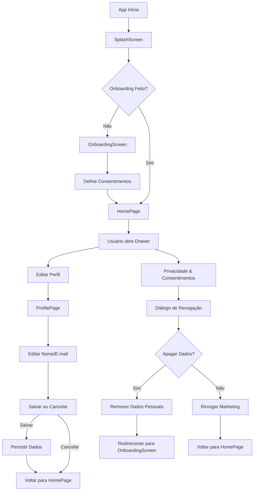

# Fluxo de Execução - User Profile

Este documento contém um diagrama Mermaid representando o fluxo de execução da aplicação até o acesso ao User Profile.

```mermaid
flowchart TD
    A[App Inicia] --> B[SplashScreen]
    B --> C{Onboarding Feito?}
    C -->|Não| D[OnboardingScreen]
    D --> E[Define Consentimentos]
    E --> F[HomePage]
    C -->|Sim| F
    F --> G[Usuário abre Drawer]
    G --> H[Editar Perfil]
    H --> I[ProfilePage]
    I --> J[Editar Nome/E-mail]
    J --> K[Salvar ou Cancelar]
    K -->|Salvar| L[Persistir Dados]
    L --> M[Voltar para HomePage]
    K -->|Cancelar| M
    G --> N[Privacidade & Consentimentos]
    N --> O[Diálogo de Revogação]
    O --> P{Apagar Dados?}
    P -->|Sim| Q[Remover Dados Pessoais]
    Q --> R[Redirecionar para OnboardingScreen]
    P -->|Não| S[Revogar Marketing]
    S --> T[Voltar para HomePage]
```